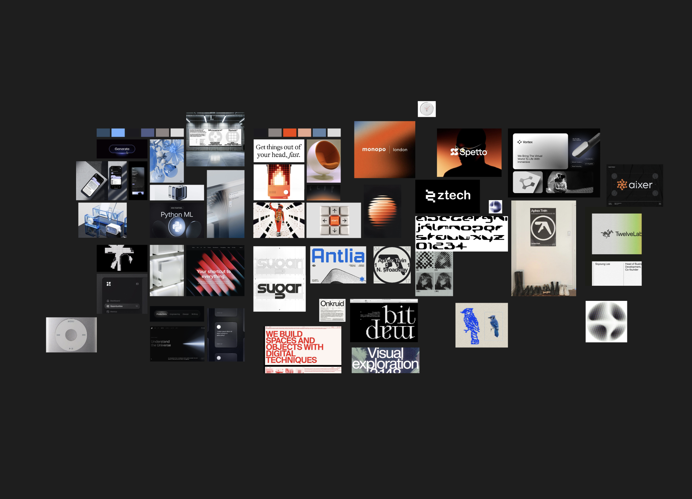

## How I work

There's a nice diagram: Empathize → Define → Ideate → Prototype → Test. Arrows, circles, everything in its place. In five-plus years, I've never once seen a project actually go that way.

TL;DR — I figure out the context → name the problem → agree on what success looks like → come up with three different paths → pick one and test it cheaply → get it to launch with the team → look at what happened and draw a conclusion. It works for a startup from scratch and for a button in settings. The scale changes; the order doesn't.

## Before I open Figma

I'm rarely brought into a project with a clean slate. So the first thing I do is map the terrain: what's already been tried and quietly buried, who actually makes the call (not on the org chart — in practice), what's really hurting the business behind the ask, and what nobody is going to rewrite under any circumstances. From the outside this looks like the designer isn't doing anything. It's the highest-return week of the project — it saves a month of running in the wrong direction.

Then I go find the actual problem. On a new product I have no data, so I talk to people: six to eight interviews is usually enough for patterns to repeat. I never ask "would you use a feature like this" — people aren't lying, they're just bad at predicting their own behavior. 

I ask about last Tuesday: how did you do this, what went wrong, what did you do instead. On an existing product I have the opposite problem — data everywhere, which is its own trap. Numbers tell you *what* and never *why*, so analytics shows me where people drop off and a handful of conversations explains the reason. On their own, each source lies.

## From sketch to shipped

I think in flows, not screens: where the person is coming from, what they already know, what happens next. Screens are frames. The product is the film. And I work the edge cases early rather than at the end — empty states, real error messages, slow connections, 500 rows instead of three, someone without permissions, a name three times longer than the mockup expects. A product feels cheap not because the home screen is badly drawn, but because nobody thought about the second Tuesday of using it.

Then I validate in order of increasing cost: show the engineers (ten minutes tells me what's two sprints and what already exists as a component), hallway test, then real users, then production. The rule I learned the expensive way: I'm not testing my mockup, I'm testing my hypothesis. Otherwise I catch myself hunting for confirmation and telling people where to tap. Staying quiet is physically hard. It's a skill, and it trains.

UI comes last, once the logic holds up — design system components doing the work, not inspiration. And I stay with it through release: walking the flow out loud with engineers before they start, keeping the line open so nobody quietly invents a worse solution, doing design QA on a real device with real data, and sorting feedback into "blocking" and "later." A designer for whom everything is equally important quickly becomes a designer whose notes nobody reads.
