## About the product

[Alfa-Bank](https://alfabank.ru/) is Russia’s largest private universal bank, serving more than 44 million retail customers. Public mobile-app benchmarks have estimated its combined iOS and Android audience at close to one million daily active users, giving products launched within its ecosystem the potential to operate at nationwide scale.

## Background on the task

Carrie’s birthday is in two weeks. Someone in the group chat suggests, “Shall we chip in for a gift?” One person shares their card number. Someone gets the amount wrong. Someone else promises to transfer the money “tomorrow” and forgets. Three days later, the organizer can no longer remember who has contributed and who has not.

The problem is the tool. The collected money sits in someone else’s account, mixed with everything else, and the only thing separating it is the organizer’s memory. This is the problem we set out to solve: creating Sobiralka, an Alfa-Bank service that makes collecting money as a group clear and effortless.

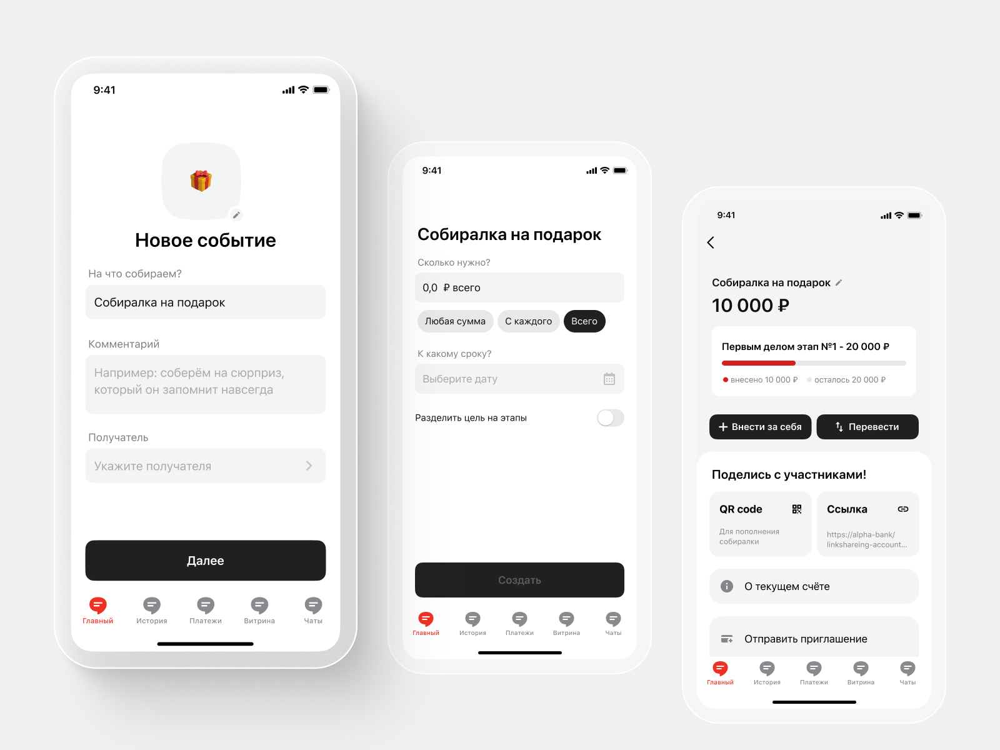

## Business Challenge

The brief was simple: develop a money collection concept that would allow a bank customer to set up a group collection in under a minute, while participants could contribute through any convenient method and from any bank.

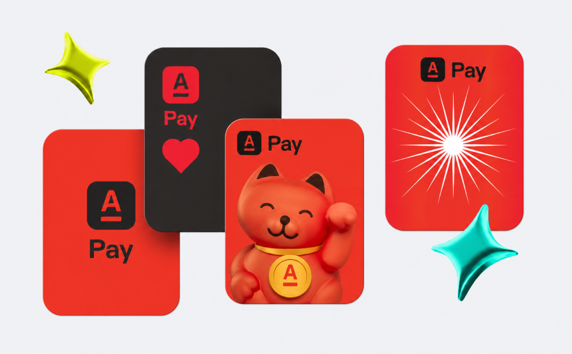

Sobiralka was not simply a goodwill feature for customers. It was a strategic business opportunity:

- Engagement and customer growth. A feature that differentiates the bank from its competitors and gives people a reason to open the app more than once a month.
- Transaction activity. Every collection generates multiple transfers, including some from people who do not yet use Alfa-Bank.
- Brand perception. A bank associated with birthdays and trips builds a different relationship with its audience than one associated mainly with loans.

**Success metrics**

- Time to create a collection: <1 minute from opening the app.
- Invite-to-contribution conversion: ≥60%.
- Average amount collected: a 20% increase compared with existing P2P transfers marked as “gifts.”
- Retention: ≥30% of users create another collection within three months.
- Average number of participants per collection: >5.
- Increase in NPS.

Stretch goal:
- Growth in annual revenue driven by newly activated users of the bank’s products.

## Who Chooses and How

The first idea I challenged was that users “choose a bank.” They do not. They hire a solution for a specific context.

The audience was therefore broader than Alfa-Bank’s existing customers: digitally active people aged 18–35, families and groups of friends, workplace teams and clubs, and socially active people organizing charitable collections.

This is a classic Jobs to Be Done scenario, which I mapped as a clear sequence of decisions:
- Need recognition—“I need to collect money from my friends.”
- Initial filter—does my bank offer this, how quickly can I set it up, and are there any fees?
- Comparison—“Sber already supports group collections,” “T-Bank has a polished experience.”
- Social considerations—will it be easy for my mother to contribute? Will friends without Alfa-Bank have to install the app?

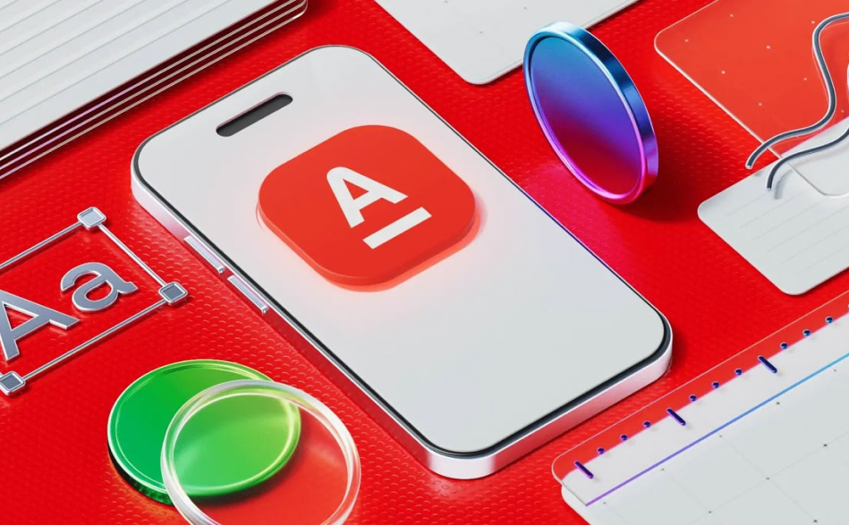

I then aligned the challenge with the values Alfa-Bank communicates as a company: openness, partnership, and responsibility.

- Openness → a transparent activity feed. Users can see what is happening with the collection and its funds at any time.
- Partnership → the service works equally well for Alfa-Bank customers and their friends who use other banks.
- Responsibility → collected funds remain separate from personal money. Each collection receives a dedicated account.

## Benchmarking

Before designing a single screen, I examined how nine different players had approached the same challenge. The goal was not to copy their strongest features, but to identify the market’s shared blind spot.

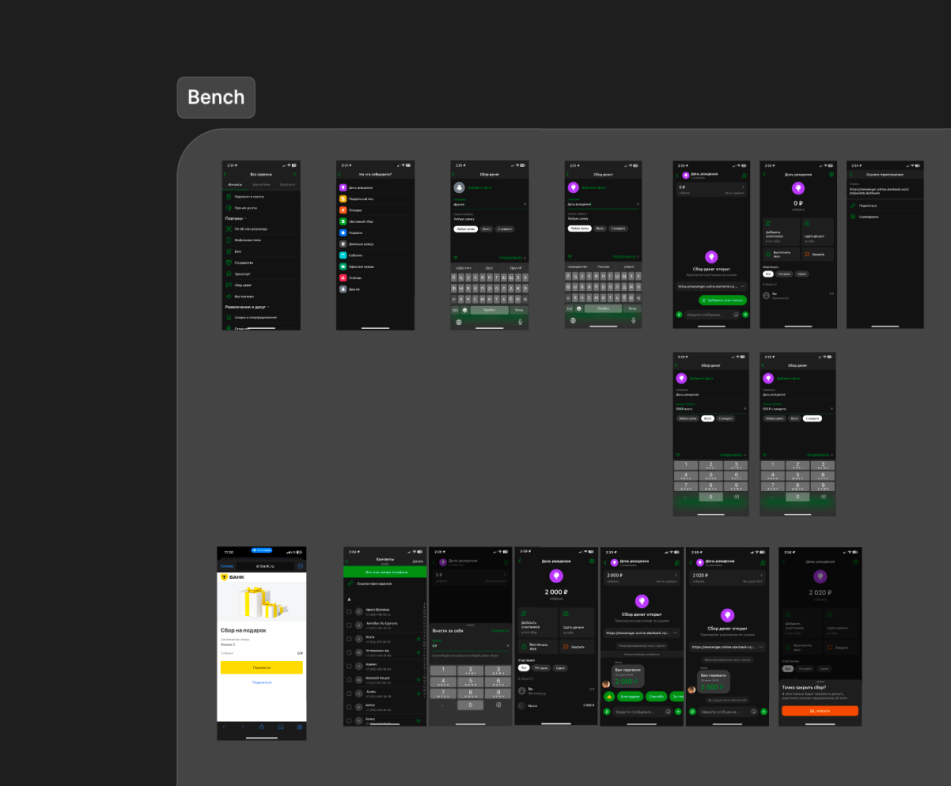

The pattern was clear. Russian banks such as Sber and T-Bank offered technically convenient collection tools, but the money still landed in a regular account and became mixed with personal funds. Even the market leaders had not solved the core user problem. International money-pot services kept collected funds in a separate wallet and addressed this issue more effectively.

Competitor analysis showed what already existed. I turned to research to understand what could actually work.

- Reyniers & Bhalla, 2013. Design implication: anonymity should be an explicit choice, not an option that is simply absent.
- Yuan et al., 2019. Design implication: the list of people who have already contributed should be visible, not hidden three screens deep.
- Yuan et al., 2017. Group gifting increases participant activity and strengthens social connections. Design implication: the collection feed should feel alive and continuously update, rather than function as a static progress bar.
- Szolnoki & Perc, 2013. Design implication: the organizer and their story should be central to the screen—not an abstract figure saying “₽20,000 needed.”
- Kim et al., 2025. People consistently prefer shared consumption to individual consumption, as demonstrated through donations on Twitch. Emotion and spontaneity trigger payments more often than deliberate calculation.

## Hypotheses and Ideas

Taken together, the findings suggested that people are motivated less by money than by a sense of belonging.

**This became the central idea behind the concept:**
The experience should focus on emotion and the sense of people coming together—not on the money itself. Group purchases should feel less like a financial obligation and more like an opportunity for creativity and care.

**I translated the remaining ideas into testable hypotheses:**

1. If a collection is presented as an emotional event—with photos, stories, and a warm description of its purpose—the average number of participants and contribution size will increase.
**Metrics:** average participants per collection, average contribution, share of completed collections.
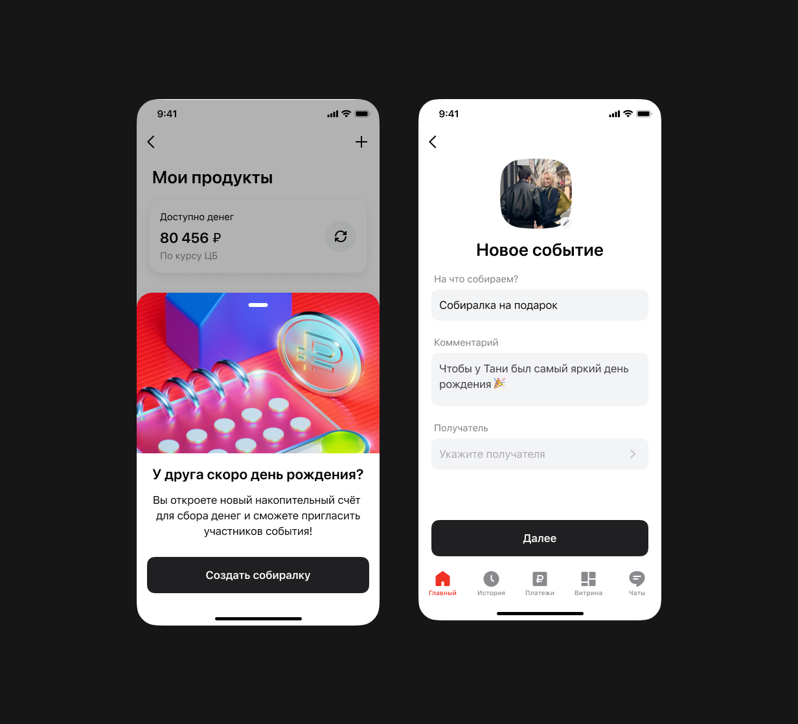

2. If participants can see who has already contributed, invite-to-contribution conversion will increase.
**Metrics:** conversion on the collection screen, time required to reach the first 50% of the target.

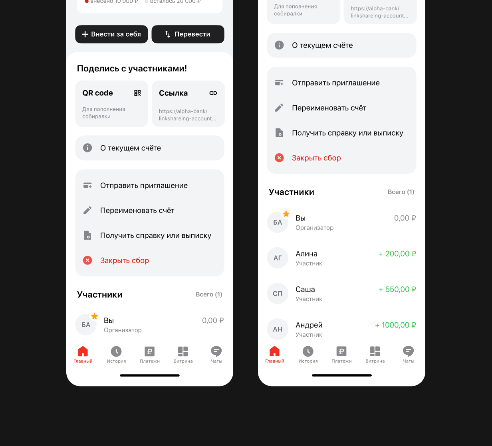

3. If the experience includes game mechanics such as a progress bar and milestone unlocks, contribution activity will increase during the first 24 hours after launch.
**Metrics:** percentage of the target collected within the first 24 hours, participant retention throughout the collection.
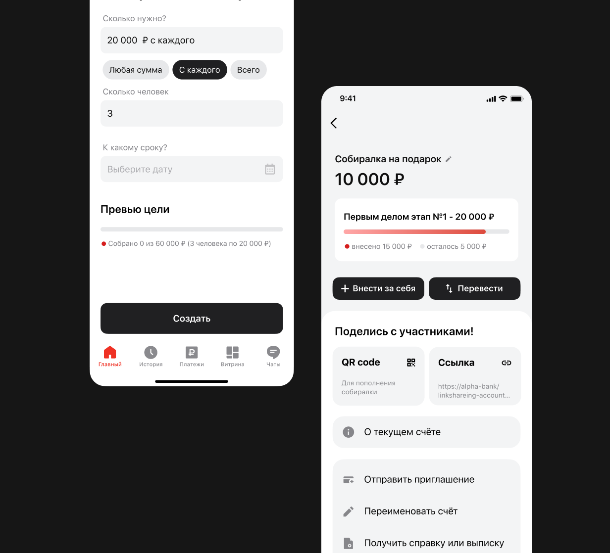

4. If people can contribute anonymously, fewer users will opt out because of social discomfort, and the total amount collected will increase.
**Metrics:** share of anonymous contributions, total amount collected, survey-based emotional comfort.

5. If people can contribute from any bank through simple methods such as a QR code or link, the share of participants outside Alfa-Bank will increase.
**Metrics:** share of external-bank transfers, invite-to-contribution conversion.
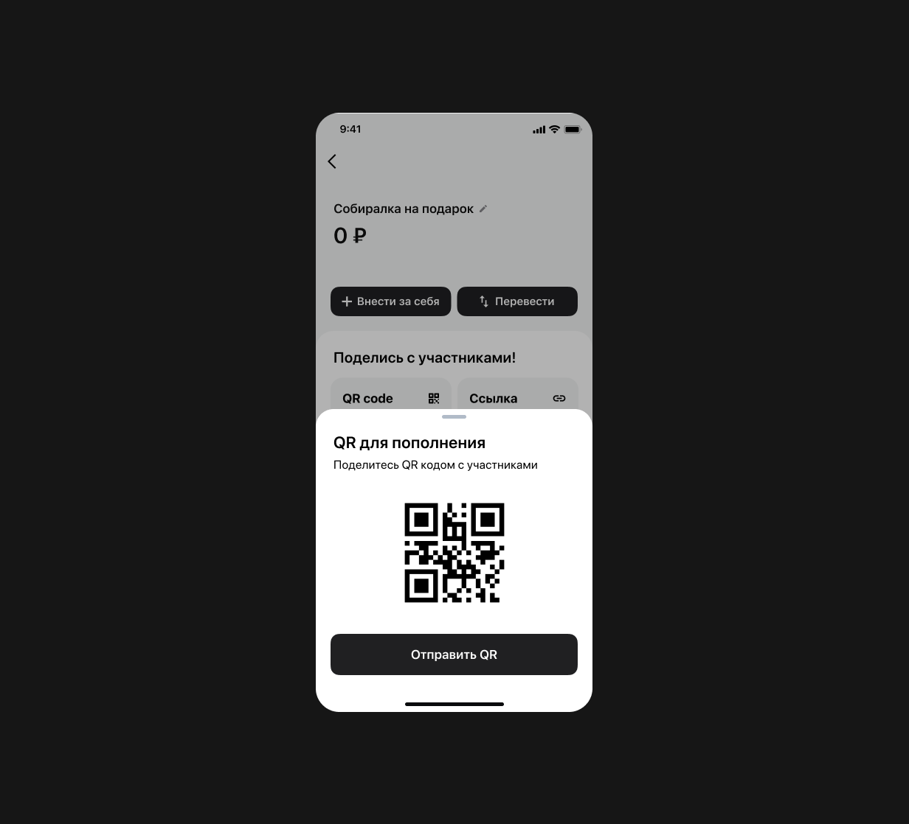

6. If participants can add notes, photos, or stickers to their contributions, the average contribution and level of emotional engagement will increase.
**Metrics:** average contribution, percentage of participants leaving a message, event NPS.

7. If the overall target is divided into smaller milestones, observer-to-participant conversion will increase.
**Rationale:** behavioural economics suggests that large goals can be discouraging, while smaller goals feel achievable.
**Metrics:** share of people who contribute after an interim milestone is announced.

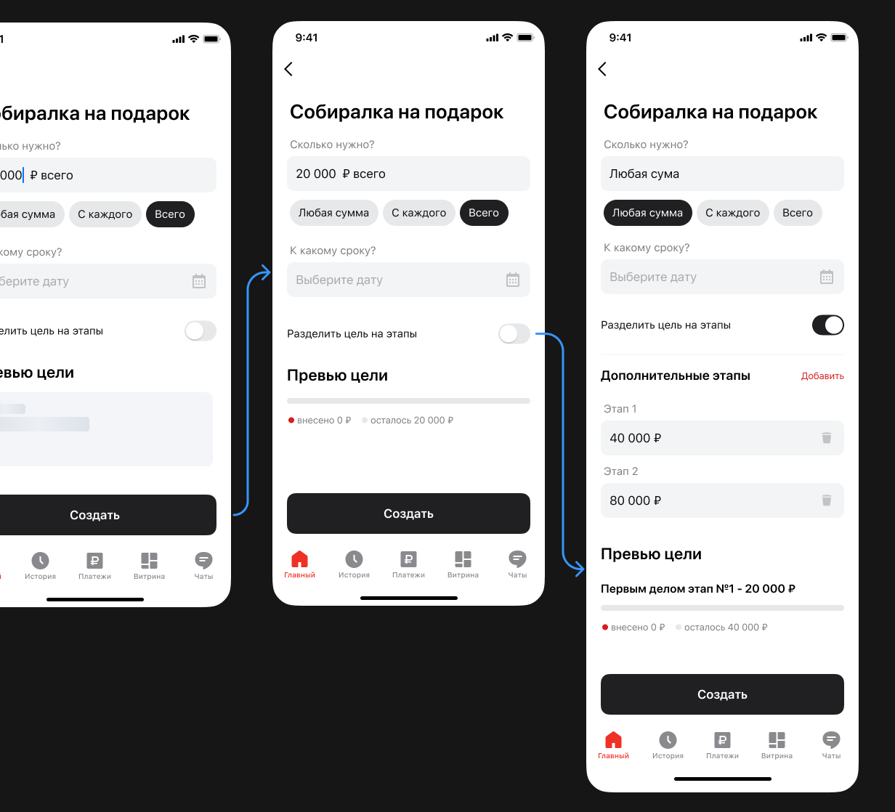

8. If users can add a desired gift or purchase from popular marketplaces and track its price, they will be able to set and manage a more accurate collection target.

I then mapped the core user flows required to support the scenario and prepared them for detailed system analysis.

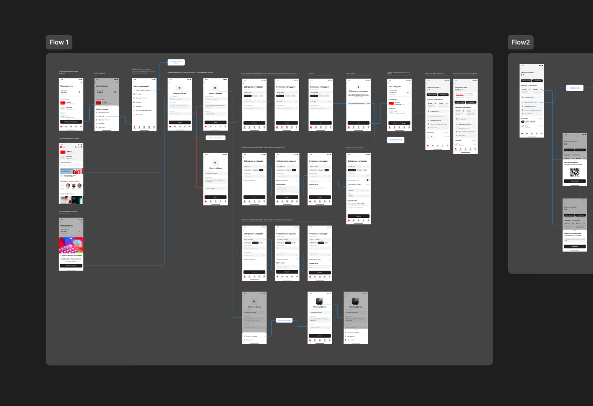

## Outcome

I brought together the bank’s business context, publicly available research, and competitive benchmarking, then filtered the findings through clear product principles. This work formed the foundation of the final concept.
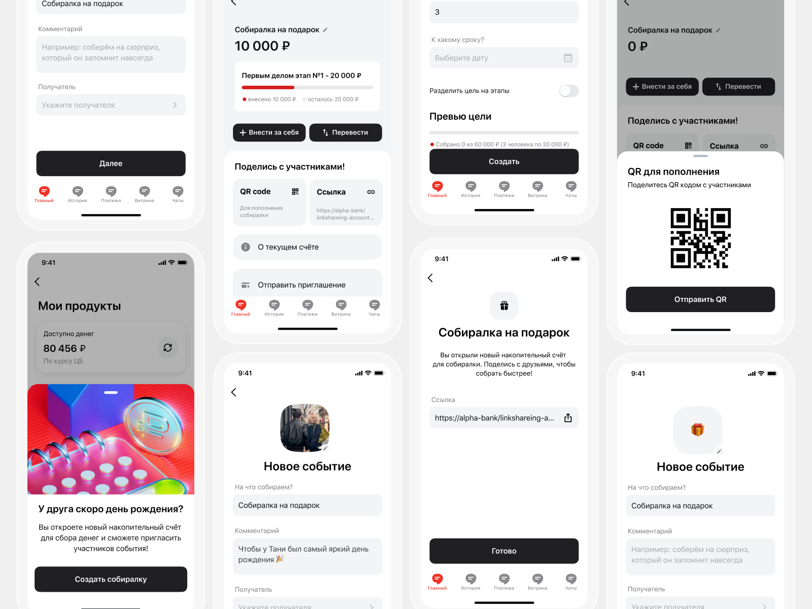

