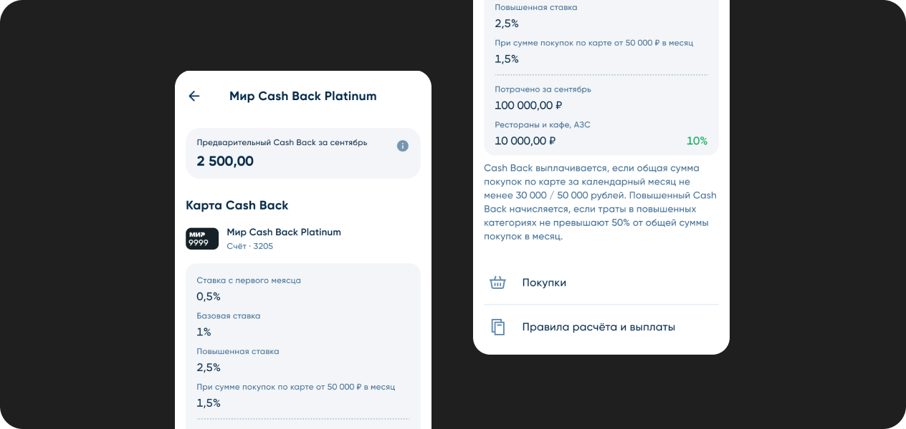
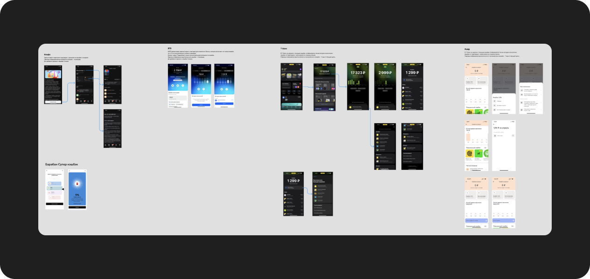
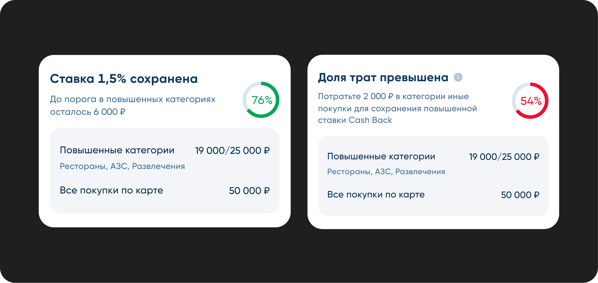
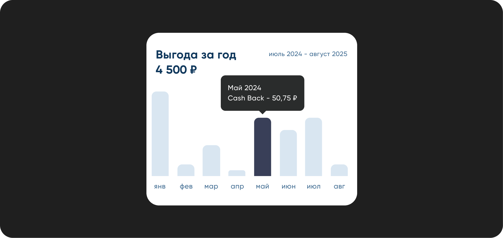
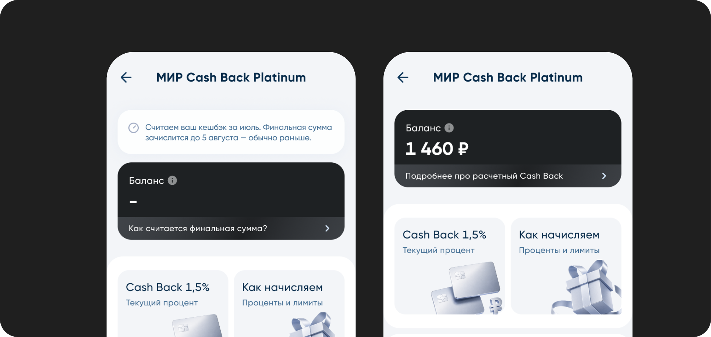
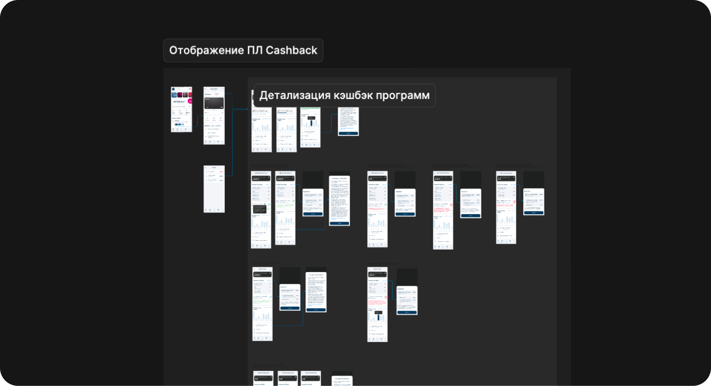
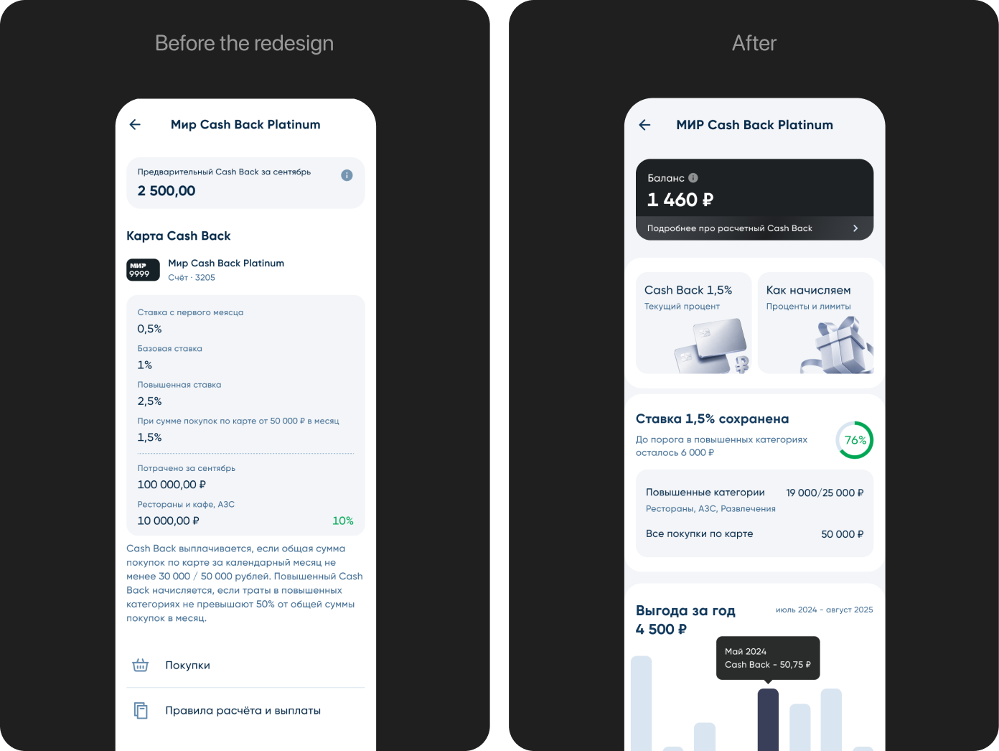

## Context & Problem
[Bank Saint-Petersburg](https://www.bspb.ru/) is one of Russia's largest regional banks, founded in 1990. In 2024, the bank posted record net profit of ₽50.8 billion. The BSPB services have ~500–600K DAU and ~1 million MAU active users. 

BSPB runs several cashback programs across Visa, Mastercard, and Mir cards — each with its own conditions, rates, and accrual limits. For premium cards, the elevated rate (1–1.5%) only kicks in when a customer hits specific monthly spend thresholds and maintains the right category mix.

The problem? In the app, customers could only see a preliminary cashback estimate from the *previous* month. No real-time rate status, no progress toward conditions, no indication of how much more they needed to spend. Nothing actionable.

The core issue: a complete lack of transparency and interactivity — and for premium products with complex conditions, that's not a minor inconvenience. It's a trust problem.

Here's what was actually broken (pulled from the as-is analysis and support ticket data):
- No clear indication of which rate is currently active
- Conditions were a wall of text. Dense, jargon-heavy, and nearly impossible to parse quickly
- Monthly accrual limits weren't shown anywhere, no spend history
- No signal of how much more a customer needed to spend to unlock the higher rate
- Between the 1st and 5th of each month, the actual cashback amount was invisible 
- No consistent UI pattern across card types

## Framing the Task

Before touching any UI, I pushed back on the brief itself.

Our obvious solution was to build a beautiful visualization *on top of* a complex rule. Progress bars over a "max 50% spend in elevated categories" condition. That's polishing a confusing product, not fixing it.

So I framed an explicit fork in the road: Are we fixing the interface around a complex rule — or fixing the rule itself?

I didn't have the authority to renegotiate the product logic unilaterally (pricing, economics, compliance all had stakes in it). But I made sure to build that question into the hypothesis set as a testable scenario — because the answer could matter more than any design decision I made.

Goal. Surface what customers actually need from cashback visibility and use that to drive transparency across the program. The business chain: clarity → trust → engagement → revenue. 

Audience. BSPB customers with active cashback cards — split into two distinct segments: power users optimizing their spend, and new customers still figuring out how the program works.

**Success Metrics (what we're measuring in A/B)**:
- Cashback section open rate.
Are more customers actually visiting the section? Tracked as statistically significant lift in unique opens per month. This is a leading indicator.
- Support contact rate. Target: meaningful reduction month-over-month. This is the clearest signal that the transparency problem is solved.
- Condition completion rate. The share of eligible customers who actually hit their cashback conditions in a given month. This metric validates whether the design is doing its job or just decorating a broken experience.
- CSAT & NPS. We use them to confirm the leading metrics are moving for the right reasons.

## Discovery & Research

I ran a benchmarking pass first, looking at how competitors handle cashback visibility and what patterns had emerged across the market.

Two things stood out:

- The market is moving toward full transparency. Category leaders have already shipped real-time status displays and predictive cashback forecasts.
- Simplicity is winning. Banks are moving to straightforward cash accrual.

Best practices across the top performers: direct accrual, full visibility during transition periods, detailed spend breakdowns, instant condition status feedback, and interfaces that don't require customers to read a terms document.

I also reviewed published research on loyalty UX and behavioral economics to help shape the design.

## Hypotheses

All hypotheses follow the same format:

H1 · Actionable conditions widget. Swap the static conditions list for a dynamic widget with a personalized nudge: *"Spend ₽8,500 more before the month ends."* We measure condition completion rate and support contacts. We expect both to move — more completions, fewer tickets.

H2 · Progress over prose.Replace the wall of text with real-time progress bars — total spend vs. threshold, category share. We measure completion rate and how long it takes someone to answer "did I hit my conditions?" Kill it if that task time doesn't drop.

H3 · Interactive spend breakdown. A dashboard showing cashback by category plus a forecast for next month. We measure section engagement and 7-day retention. Kill it if retention doesn't differ from the control group.

H4 · Condition detail view. A dedicated view that shows exactly how to earn the maximum cashback rate — progress state, current status, clear guidance. We measure comprehension via a post-task survey and the share of users reaching the "conditions met" state.

H5 · Close the 1–5 blind zone. Show a preliminary cashback estimate during the transition period instead of effectively showing nothing. We measure "where's my money" support tickets in the first five days of each month.

H6 · Smart notifications.
Personalized nudges at the right moment — a push when someone's close to their limit, a reminder about a high-cashback category they've been underusing. We measure card activity and condition conversion, with a guardrail on notification fatigue. Kill it if push opt-outs grow faster than engagement.

H7 · Forecast as a range, not a single number. Show "estimated ₽1,400–1,520" instead of one precise figure. A pinpoint forecast sets an expectation the final payout might not meet — and that gap drives complaints. A range manages expectations honestly. We measure "paid less than shown" support contacts.

H8 · Different experience for different segments. New users get onboarding and education — "here's how cashback works." Power users get spend optimization tools. Research flagged two distinct segments with different needs, but we shipped one experience for both. We measure new user activation and power user engagement separately.

H9 · Contextual nudge at the point of decision.Surface the elevated cashback rate before or during a purchase — in the partner map, in the Apple/Google Pay overlay — not after the fact in the app. This changes actual spending behavior, not just awareness. It's a direct extension of the actionable widget from H1.

H10 · Loss-aversion framing. "You're losing your 1.5% rate — spend ₽2,000 to keep it" vs. "spend ₽2,000 to earn 1.5%." Loss framing is consistently more motivating in financial contexts. That said, it edges into manipulation territory — mandatory guardrail on CSAT and pressure-related complaints. Kill it if complaints go up or CSAT drops.

Prioritization

Six — now twelve — hypotheses without ranking is just a backlog. Here's the RICE breakdown (Reach × Impact × Confidence ÷ Effort) to make the launch sequence explicit

Then I started designing high fidelity flow, delivering all components that are needed

## Solution & Results

After testing and iteration, here's where we landed — before and after:

We shipped:

- Actionable progress widget replacing the static condition block
- Closed the blind zone — preliminary cashback shown as a range during 1–5 transition
- Unified component — one configurable design system component across all card types
- Spend history inline — annual earnings chart surfaced directly in the cashback section
- Edge states — designed first-open, zero-spend, overdue, and error states

What We Moved:
- Transactional activity — customers started using their cards more intentionally, spending in the right categories because they finally understood the conditions.
- Cashback section DAU: 100,000 → 250,000 — visited 2.5× more often, while support contacts dropped simultaneously. People are finding answers in the interface.
- Support contacts: 120 → 32 per month — the clearest signal that transparency is working.
- Condition completion rate: 42% → 60%.
- CSAT: 3.1 → 4.0 · NPS: −8 → +10 — from negative territory to positive.

