## Context and problem

When the project started, the Bank Saint Petersburg (BSPB) app had no dedicated tools for self-employed customers.

In Russia, eligible self-employed workers can use a simplified tax regime known as NPD. They report income by issuing digital tax receipts, then pay the tax separately.

Problem: BSPB’s self-employed customers received payments and reported income in separate apps. They had to manually match incoming payments to receipts and track their tax bills elsewhere.

Main goal: Bring payments, income reporting, and tax management into one clear flow within BSPB, while keeping users in control of which payments count as income from work.

## Audience

Analysts estimated that a significant share of existing retail customers either used NPD or received regular incoming payments. New customers were another potential audience. The main segments were:

- Newcomers — want to formalize their work but have not registered yet
- Switchers — already registered, using the government’s My Tax app or a competitor’s service
- Side earners — have a main job and receive 2–5 payments a month
- Professionals — freelancers or skilled service providers handling 20+ transactions a month

Priority MVP scenario: a customer receives payments through BSPB, issues receipts themselves, and uses the banking app for everyday finances.

## Discovery

Research inputs:

10 in-depth interviews: 5 registered self-employed workers, 3 considering registration, and 2 formerly registered.
Support requests on related topics: transfers, payment descriptions, and proof of income.

A review of My Tax, Russia’s official app for self-employed taxpayers, and competing banks’ apps with similar services.
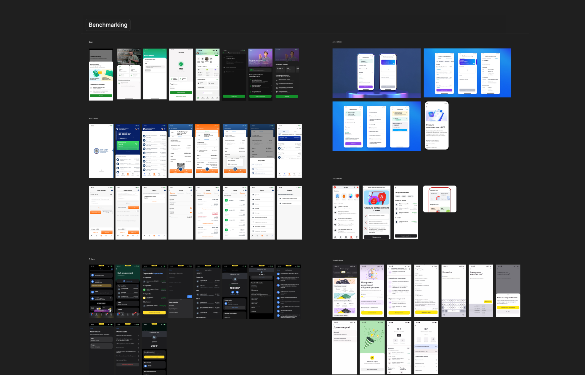

I also reviewed filtering patterns already used in the BSPB app: transaction history, savings deposits, date ranges, and credit products.
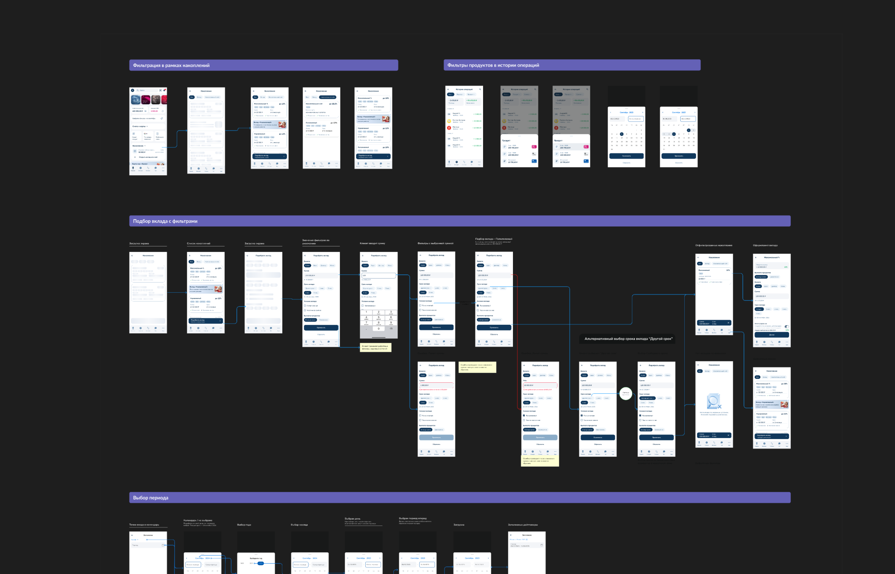

Key findings:

1. The biggest pain point was the routine after registration.
Registration starts a monthly cycle: remember a payment, issue a receipt, send it to the client, set money aside, and pay tax by the 28th. This was where users struggled most.

2. People confused issuing a receipt with paying tax.
A recurring interview comment was: “I issued the receipt, so I’ve paid the tax.” This misunderstanding led to overdue payments and penalties.

3. One routine, two apps.
Payments were in one app, receipts in another. Users rarely reconciled the two, leaving income unreported and tax amounts difficult to understand.

4. Documents were always needed at short notice.
Clients requested proof of self-employed registration when signing a contract. Banks and visa applications required proof of income. Both were usually urgent.

Based on these findings, the team and I explored ideas and drafted jobs to be done and hypotheses.

<mark>The core jobs to be done</mark>:

- I want to report income as soon as a payment arrives, without switching apps
- I want to separate work payments from personal transfers without accidentally reporting extra income
- I want to send my client a receipt their accounting team can accept
- I want to pay tax on time and avoid penalties
- I want to quickly get proof of my registration or income when requested
- I want to understand how close I am to the scheme’s annual income limit and what happens if I exceed it
- I want to correct a receipt issued for the wrong amount or client

## Hypotheses

<mark>H1 · Home screen widget</mark>

Hypothesis: Adding a Self-employment widget to the home screen, with access to the service and one-tap entry points for issuing receipts or paying tax, would help users find actions faster and complete them more often by shortening the path from opening the app to getting things done.

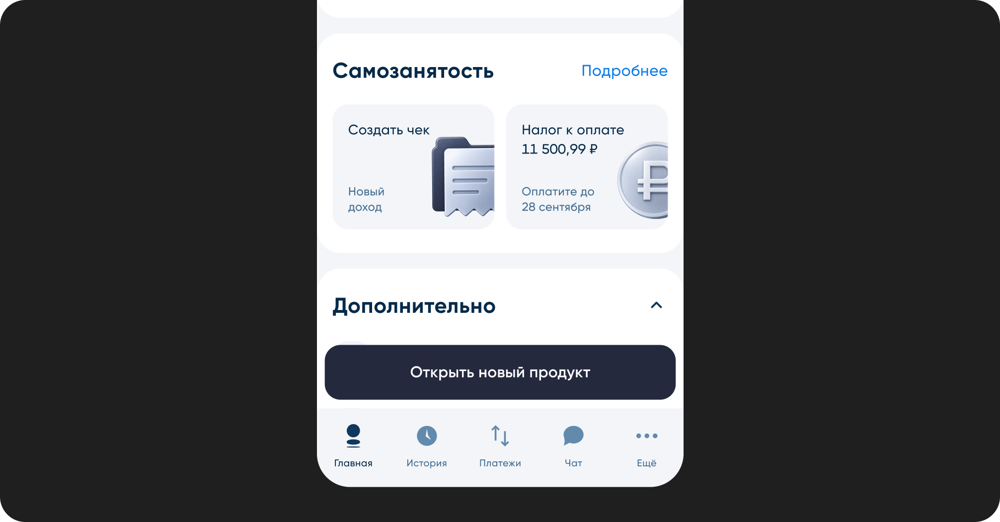

<mark>H2 · Giving users control over payment review would improve income reporting</mark>

The idea was to make the incoming payments feed closely resemble the main transaction feed in the BSPB app.

Hypothesis: Showing the time, payment note, and receipt status alongside each transfer would help users distinguish similar transactions and see which ones they had already processed.

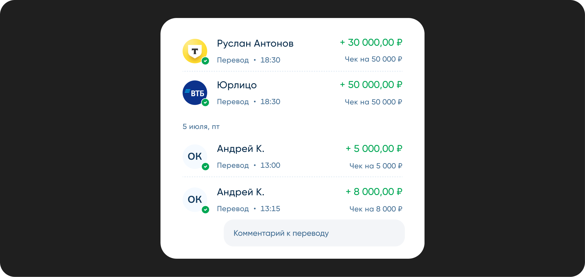

I built the feed around familiar transaction history patterns, adding details relevant to self-employed users: transaction time, payment note, and receipt status. Date range and card filters helped narrow the list to relevant payments.
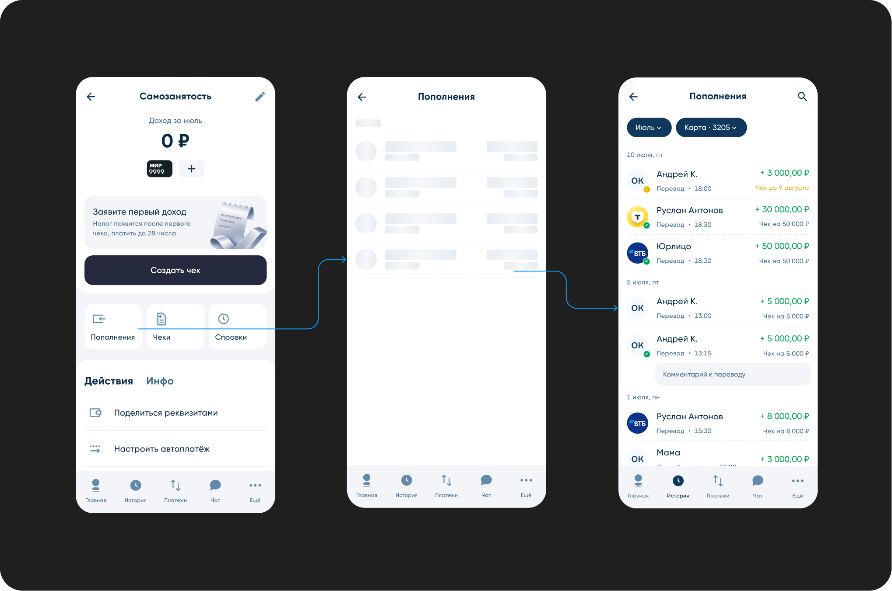

<mark>H3 · Separating estimated tax from tax due would reduce confusion</mark>

Rationale: The research revealed confusion between issuing receipts and paying tax. Under Russia’s Federal Tax Service (FNS) rules, the monthly tax bill becomes available after the income is reported.

Hypothesis: Showing “Estimated tax for September” separately from “Tax due for August” would help customers identify the amount they actually owed and its payment deadline.

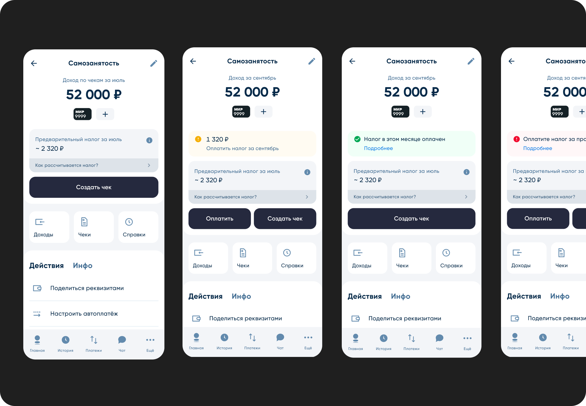

<mark>H4 · Guided onboarding through the first receipt would improve activation</mark>

Hypothesis: Showing a relevant next step after setup, tailored to the customer’s situation, would help more users successfully report their first payment.

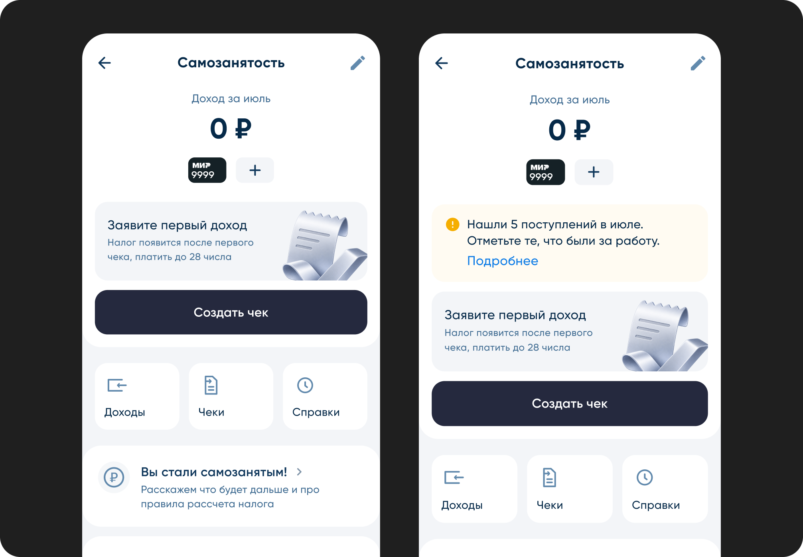

<mark>H5 · Report income from multiple transactions</mark>

Hypothesis: Letting users select multiple transactions would reduce the time spent issuing receipts and the fatigue of repetitive actions.

In this concept, users select incoming payments and review a separate receipt for each one. They can fill in missing details, while a “0/2”, “1/2”, or “2/2” indicator tracks how many receipts are ready. The issue button shows the number of prepared receipts.

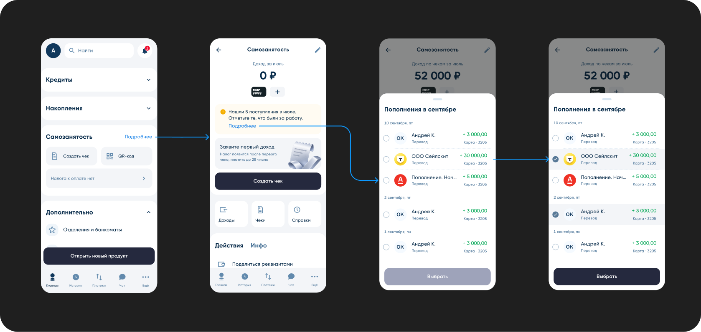
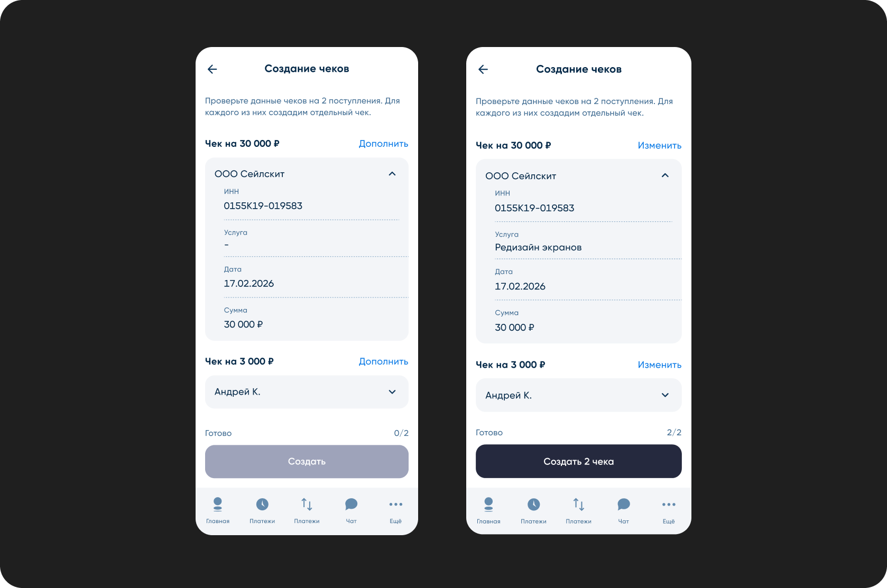

<mark>H6 · An extra step before issuing a receipt</mark>

Hypothesis: Offering a list of recent incoming payments during receipt creation would help users find the right client payment and issue a receipt faster, connecting payment selection and income reporting in one continuous flow.
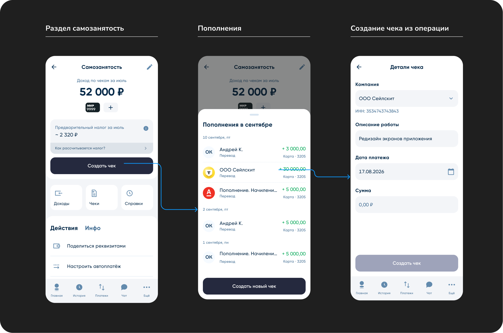

## MVP scope

After discussing the hypotheses, we prioritized them as a team to decide what to build for the first release. The MVP included:

1. Onboarding for new and already registered self-employed customers;
2. A service dashboard showing income and tax status;
3. Reviewing incoming payments and creating receipts from transactions;
4. Creating a new receipt manually;
5. Viewing, sharing, and cancelling receipts;
6. Paying tax and setting up automatic payments;
7. Obtaining official documents and ending self-employed tax registration.

Here is the completed receipt creation flow:

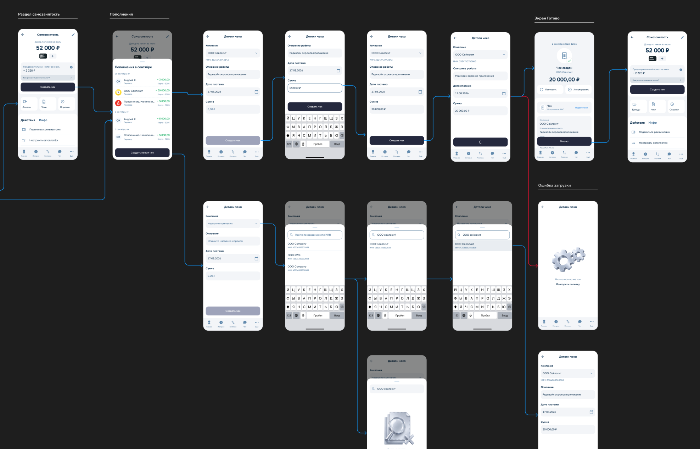

Deferred for later:
- Bulk income reporting, costly to build, with demand confirmed in only one interview segment
- Payment links and QR codes, required merchant payment processing infrastructure
- YARKO loyalty points for tax payments, required a separate business case for the bank’s rewards program

## Results and my role

The launch brought a new service to the app, connecting incoming payments with the receipts used to report that income.
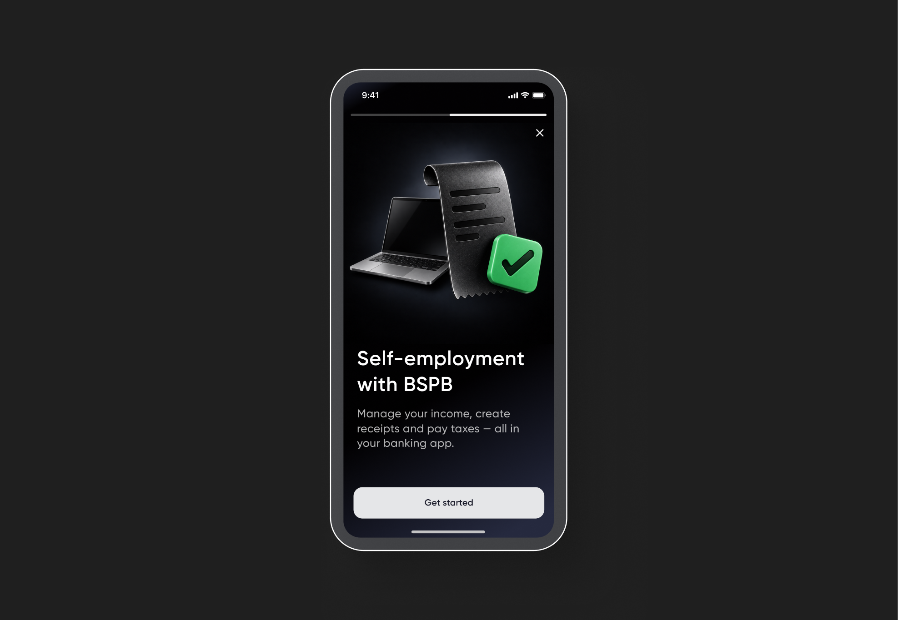
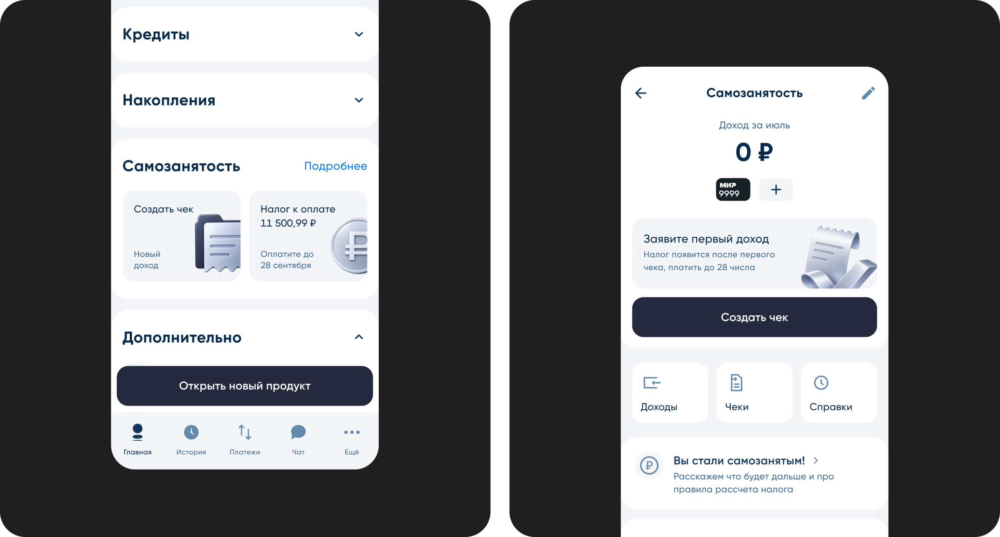
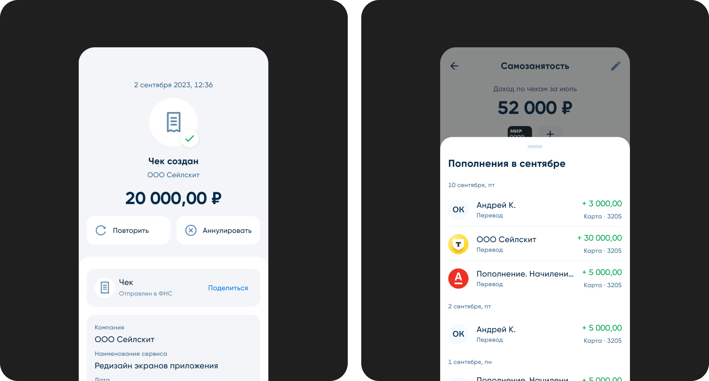
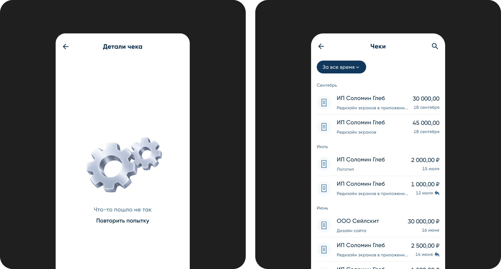

1. In the first three months after launch, 40% of new users of the self-employment service completed setup, received a client payment, and created a receipt from that payment.
2. Self-employment support requests fell by 30%. We compared the absolute number of relevant requests across selected periods. This metric reflects the change in support workload.

My role:
- Discovery: 10 interviews, support request analysis, and competitor research
- Defining jobs to be done and hypotheses, and prioritizing them with the product manager
- Low- and high-fidelity designs, including more than 6 concepts for the service’s main screen alone
- Designing all screen states: empty, error, loading, tax authority rejection, and deregistration
- Developer handoff and specifications for filtering logic and statuses
- Prototype usability testing
- Working with a content designer on onboarding, receipt, and notification copy
