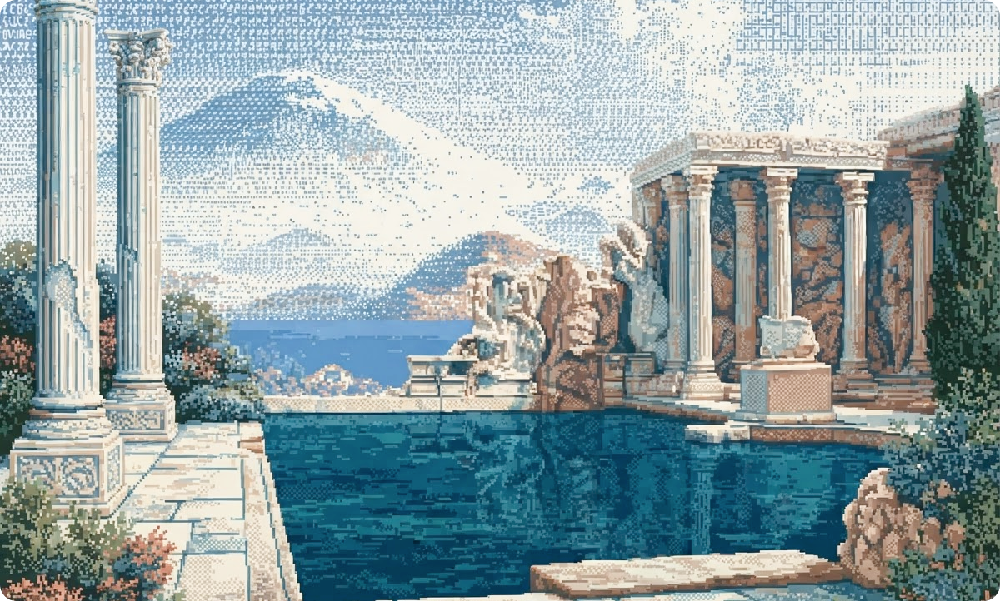
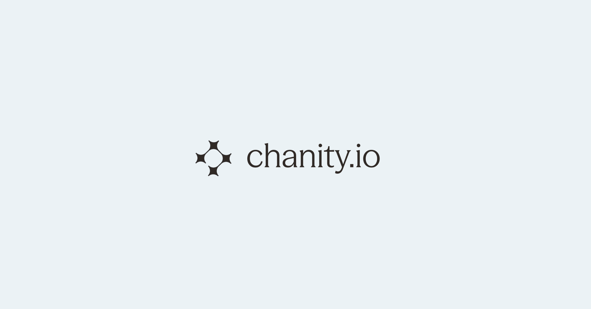
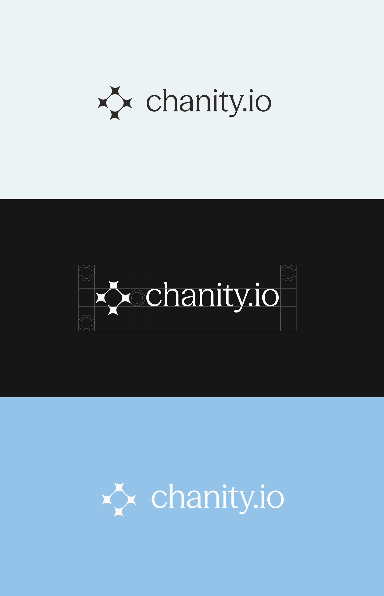
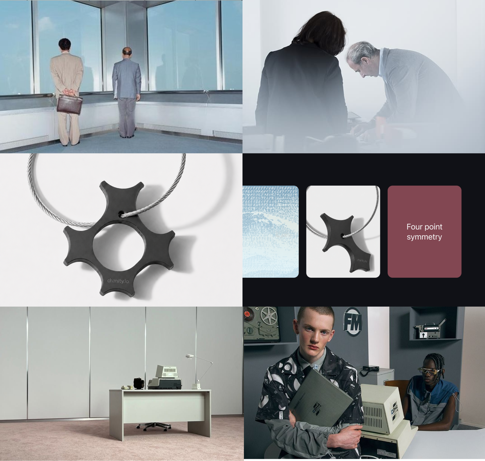

## Overview

When I started working on this project, the client didn't have a clear vision of what they actually wanted. They knew they needed a brand. They couldn't tell me what it should feel like, who it was really for, or what separated it from the twenty other platforms doing something adjacent. The brief was, more or less, "make it look serious but not boring."

So I started with research, and I ran a lot of interviews. So here's what we ended up with 
<video src="/videos/chanity-brand/branding.mp4" muted loop playsinline disableremoteplayback data-lazy-video></video>

I talked to the founders, to two developers building on the platform, and to a handful of people from the community — including some who'd tried the product and drifted away. I asked all of them the same set of dull questions. What does this thing do for you? What would you lose if it disappeared tomorrow? What do you tell your friends it is?

The founders gave me answers full of infrastructure language. The developers gave me answers about reliability. But the community members kept saying a version of the same thing, and it was the one thing nobody had written down: *I like that I don't have to give anything up to be part of it.*

## The metaphor problem

Then I went and looked at the category, because you can't position anything in a vacuum.

**Solana** owns innovation. Purple gradients, glowing abstractions, a visual language aimed squarely at developers who care about throughput. It says: *we are the future and we are fast.*

**Coinbase** went the opposite direction — near-total minimalism, blue and white, no mystery. It says: *this is safe, this is normal, your mother could use it.*

**Chainlink** does something smarter than either. Their logo is, quite literally, a link of a chain. You understand what the product does before you've read a word.

And that's where I got stuck for about a week. Because "chain" is the default metaphor for the entire industry, and it's a genuinely bad one.

A chain is linear. Links sit in a fixed order, each one dependent on the one before it, and the whole thing is only as strong as its weakest point. That's not how any of these networks actually behave. It's not how communities behave. It's certainly not how the thing I'd heard in those interviews behaved — *I don't have to give anything up to be part of it. I needed a different metaphor, and the obvious ones — web, mesh, hub — were either taken or dead from overuse.

## The word

I found it in a philosophy footnote, of all places.

**Symplokē** (συμπλοκή) — ancient Greek for *interweaving*. Plato used it to describe how ideas combine. In classical philosophy it means a system where independent elements form a whole through many mutual connections. Nothing gets absorbed. Nothing gets subordinated. The value shows up in the interaction itself.

That's what the client had built without having the words for it. Not a chain between people and technology — a space where independent things could weave together and stay independent. The philosophy wasn't decoration bolted on after the fact. It was a two-and-a-half-thousand-year-old description of what was already there.

Once I had the word, everything downstream got easy. That's usually how you know a strategy is right: the decisions stop being arguments.

## Drawing it

The mark is four identical shapes, touching, holding an empty space at the center.

Each one is a four-pointed star with concave sides. The concavity matters more than the points: the shape doesn't push outward, it pulls in, leaving room for its neighbors. None of the four takes up more space than it needs — which is exactly why all four fit.

The fifth shape, in the middle, is the reason any of this exists. Nobody drew it. It's made by four concave edges and belongs to none of them: remove any single element and it's gone. The brand claims Chanity is a space, not a link. In the mark, that space is literally there, and it's empty. The elements meet at their thinnest point, where the arms narrow into a bridge. The bond doesn't hold because of mass — it holds because the contour closes. It runs in a loop with no beginning, no end, and no link that outranks the rest.

It is aggressively not a chain link, and that's the whole point.

Four elements isn't the finished figure — it's a fragment cut out of a lattice. The same shape tiles into itself in any direction; there can be as many nodes as you want. An ecosystem you can always add someone to looks exactly like this.

## The rest of the system

**Color.** A wide, quiet range of blues doing the structural work, and a single warm orange used only at the moment of connection — a node, a link, a call to action. The ratio matters more than the values. Blue carries the infrastructure; orange carries the human presence. And it puts real distance between Chanity and a category that defaults to either dark futurism or corporate blue-and-white.

**Type.** A geometric sans paired with a classical serif. The sans is built from simple shapes, which makes it a literal expression of the brand principle. The serif points back to where symplokē came from. Contemporary systems, ancient ideas — the same contrast the brand runs on.

**Art direction.** No glowing cyberspace, no stock photos of people gesturing at charts. Real structures, real materials, real people: lattices, cables, woven fabric, bridges. Images where you can find the geometry of the mark already sitting in the world, rather than pasted on top of it.

## Result

A full identity system: logo and lockups, color language, type scale, art direction, and a set of guidelines the team can actually use without calling me.

But the part I'd point to first is the strategy. The client walked in without language for their own product, and walked out able to explain it in one sentence: Chanity isn't a chain between people and technology — it's the space where independent elements interweave into a single ecosystem.

