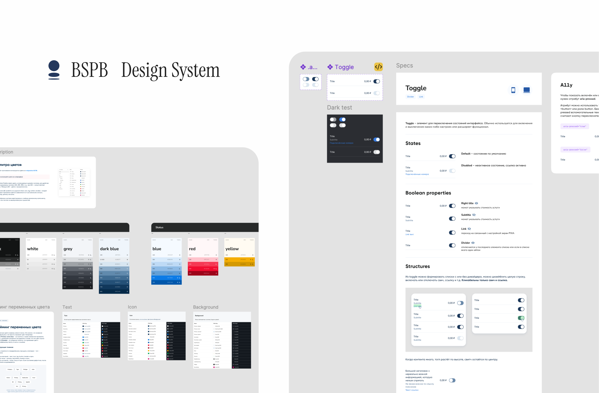
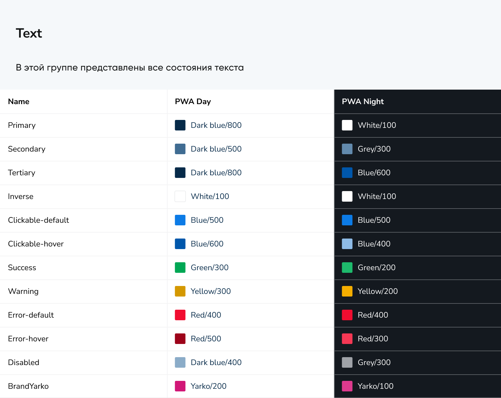
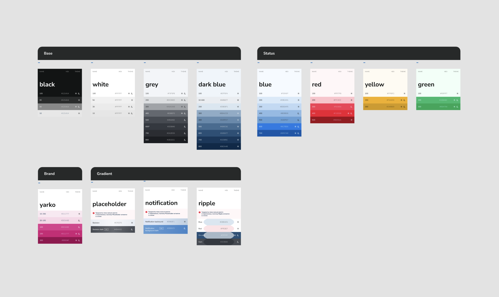
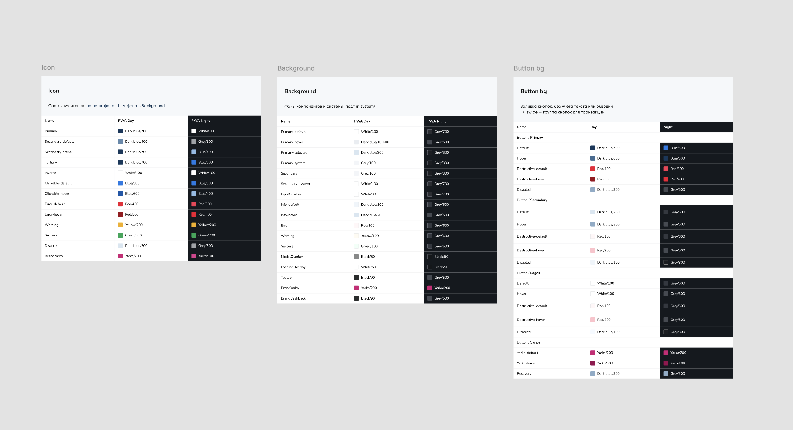
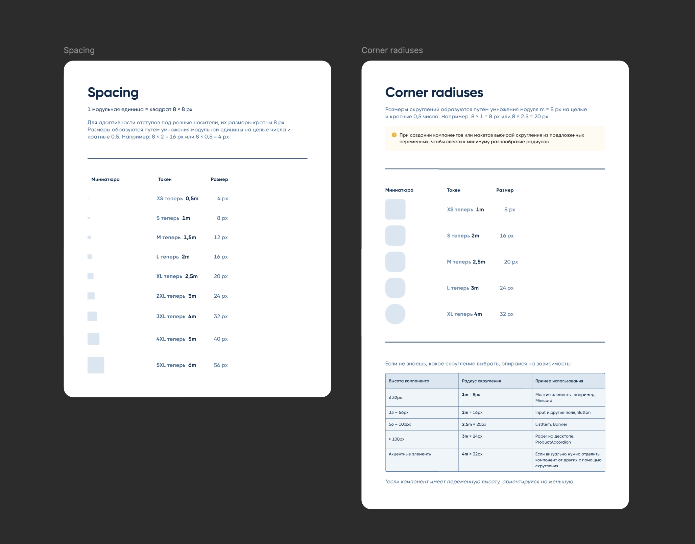
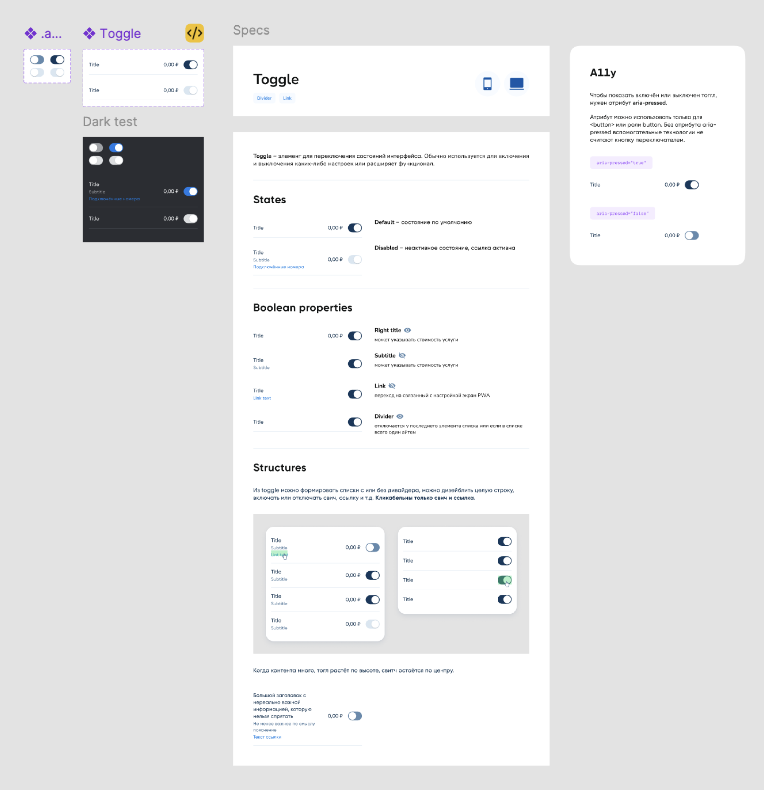
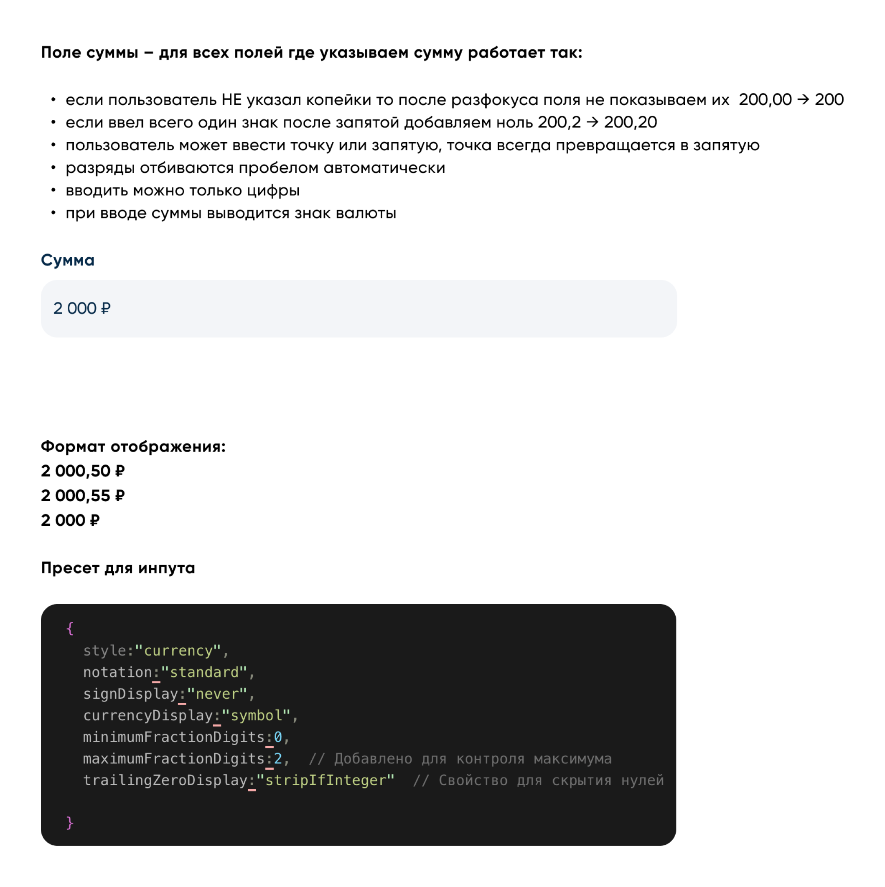

## Context

Here's how I ran the design system for BSPB's online banking: 60+ components, two themes, one shared language across the whole product team.

I owned the design system on this project, and I also owned two product areas — Loyalty and Savings. I specced new functionality alongside business analysts and picked up whatever else the quarter needed. So I was the library's owner and one of its heaviest users at the same time, which is honestly the best thing that can happen to a design system.

The most common mistake, to my mind, is starting with buttons. The system has four groups of variables: Palette, Colors, Spacing, and Corner radii. Every token is defined twice over — once for PWA Day, once for PWA Night. There is no such thing as "the dark version of the mockup" in our files. If a designer built the screen on tokens, dark mode already exists.

The most important thing I learned in all this: documentation doesn't have one reader, it has two. A designer and an engineer come to the library for completely different things. So every section is explicitly tagged: `for designers`, `for dev`, `for dev / designers`.

## How the palette is built

The first layer is Palette. Just the brand colors, numbered — 100, 200, 300 and up, where 100 is the lightest. Anything below 100 is a color with transparency.

Why? So that a designer never has to hold `#245077` in their head. People shouldn't be memorizing hex — they should be memorizing logic. You can read `Dark blue/700` and check it by eye in a second. You can't do that with `#10385C`.

The second layer is Colors. And here's the decision that matters most: the palette is broken out not by component, but by entity — `text`, `icon`, `bg`, `button`, `border`.

The logic is simple. Every component is made of these same things. An alert has a background, a border, an icon, and text. So does a button. So does a card. Hand out colors per component and the library grows linearly with the product. Hand out colors per entity and the system already covers components that don't exist yet.

## Refactoring fixed everything

Spacing and radii are built on a module: **1 module = 8 × 8 px.** Sizes come from multiplying the module by whole numbers and by halves — 8 × 2 = 16 px, 8 × 0.5 = 4 px.

The tokens were originally named like t-shirts: XS, S, M, L, XL, 2XL. It looks familiar, and it works badly. `XL` tells you nothing about the size — to find out it's 20 px, you go look it up in a table. And the t-shirt scale runs out: past 5XL you're improvising.

We moved to module names: **XS is now `0.5m`, L is now `2m`, 3XL is now `4m`.** Now the name of the token *is* its math. `3m` means three modules, which means 24 px. The scale can keep going forever and it stays predictable.

Same logic in the radius. But here I went further and locked the radius to the height of the component.

This is my favorite part of the system, and here's why. A good design system doesn't just hand you a set of values — it takes a decision off the designer's plate that never needed making. "What's the corner radius here?" isn't a design review conversation anymore. There's a height, so there's an answer.

## A component is a document

This is the part I'm proudest of. We use an atomic approach, and every component in the library is laid out to the same script:

- Atoms — the smallest building blocks
- Spec — every state, the anatomy, and the usage variants
- Theming — how the component looks in dark mode
- A11y card — accessibility attributes

## Patterns: number formatting

A design system stops being a library of pictures the moment it starts describing not elements, but how the product behaves. My favorite case for this is number formatting.

### The problem

A bank is made of numbers: prices, transaction amounts, bonuses, rates, statistics. Until the rules are written down, every team invents its own:

- one place always shows the kopecks — `200,00 ₽`
- another hides the decimals on whole amounts — `200 ₽`
- pluses and minuses land differently — `+200 ₽` vs. `200+ ₽`
- rates get three decimal places, `3,000%`, or none at all, `3%`

Every one of these looks fine on its own. The problem shows up when a user sees them on adjacent screens: unpredictable behavior from UI components, bugs in the handoff from design to engineering, and — the most expensive one for a bank — **an erosion of trust.** If an amount looks different in one place than another, the user pauses for a second to wonder whether it's the same amount.

### What I did
1. Mapped the scenarios. I found every point in the product where a number appears: input fields, statements, notifications, charts. Then I sorted them into types — currency (₽, $, €), percentages, whole-number counts of bonuses and points, and technical metrics and statistics.

2. Wrote rules for each type. The amount field, for example, works like this:

3. Took it all the way to code. An engineer and I built the formatting presets together — an `Intl.NumberFormat` config for each number type. To my mind, this is the key moment of the whole case. I documented the result in the design system with preset tables and before-and-after examples.

The result: numbers stopped being a matter of one team's taste. A designer doesn't choose a format — they choose a type of number.

## What I took away

A good system removes decisions, it doesn't add options. The height-to-radius table. One shadow. A deliberately limited list of token types. Every time I close a question with a rule, the team gets back a little attention to spend on the problems that are actually hard.

And yes — being the owner and the user of the system at the same time is the best debugging mode there is. I ran Loyalty and Savings on this same library.
