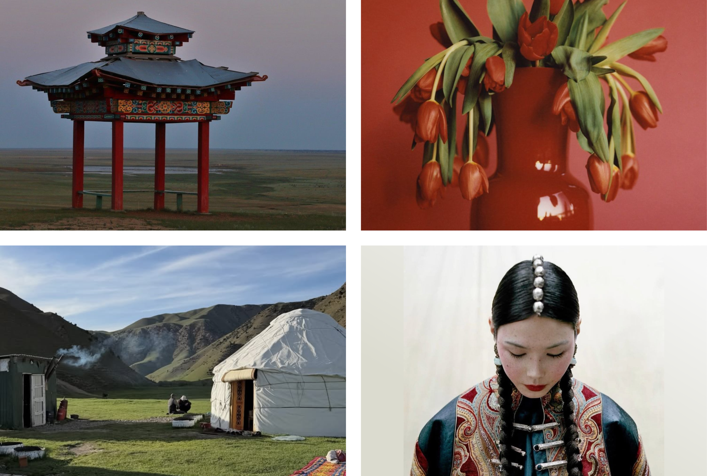
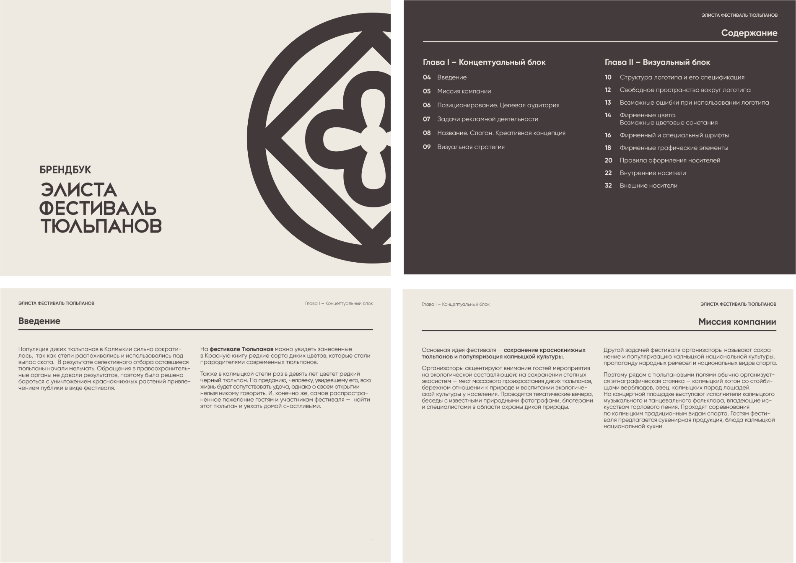
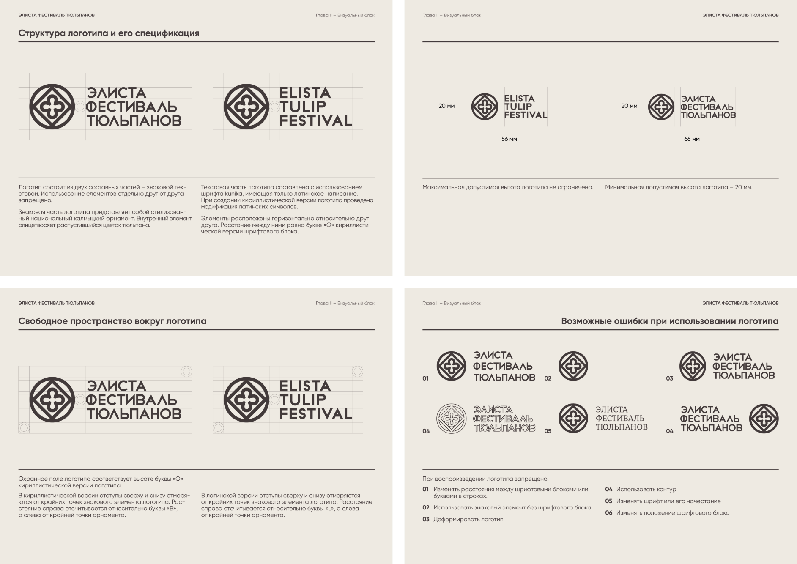
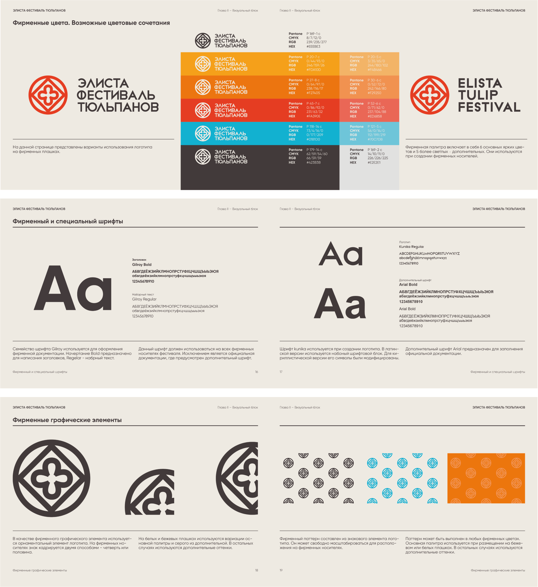
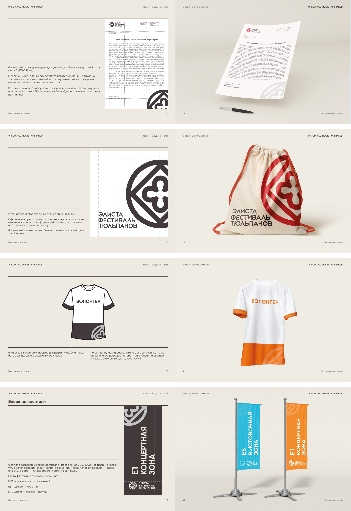
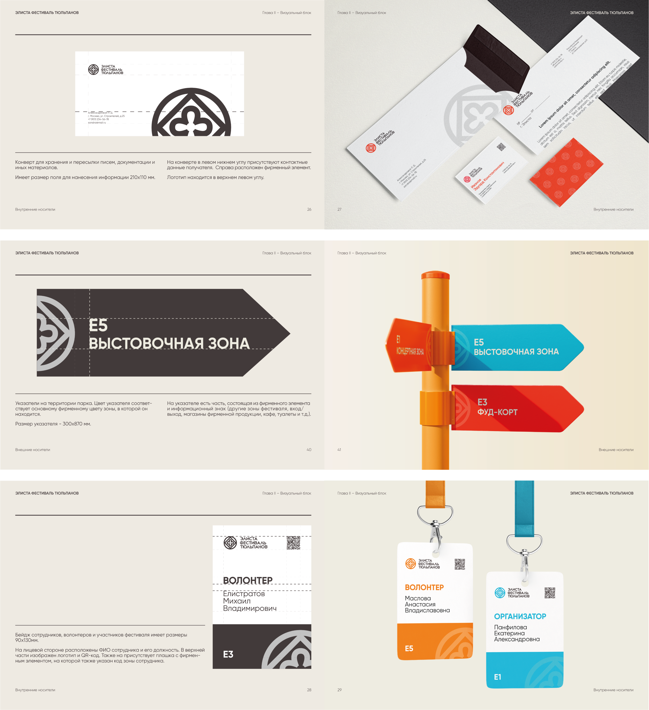

## The Challenge

When the team first handed me the brief, I didn't expect a real environmental crisis to be sitting behind all that bright, almost carnival-like branding. But that's exactly where this project started.

Wild tulips in the Kalmykia steppe — an endangered, Red List species — had been taking a beating for years from grazing livestock and, honestly, just people picking them for bouquets. Fines and official warnings weren't cutting it. So instead of trying to lock the flowers down, someone had a better idea: get people to actually come see them, fall for them, and want to protect them.

That's how the Elista Tulip Festival was born.

My job as the designer didn't start with a logo — it started with figuring out what this thing was actually about. Turns out the festival is carrying two missions at once:

- Environmental — protecting endangered tulips and the surrounding steppe ecosystem, with talks from naturalists and wildlife advocates.
- Cultural — putting Kalmyk culture front and center. Right next to the tulip fields sits a full ethnographic camp — camels, sheep, Kalmyk horses, throat singing, traditional sport competitions, Kalmyk food.

Which set up the real design challenge: the identity had to read as an eco story about wild nature *and* as an ethno-festival with real personality — at the same time, without flattening either one.

## The Mark

The heart of the identity is a symbol built on a traditional Kalmyk ornament, with a blooming tulip bud sitting right at its center. One mark, both stories — national pattern on the outside, living nature on the inside.

The wordmark runs in Kunika, a typeface that's Latin by design. So the Cyrillic version wasn't just typed out — I had to rebuild it letter by letter to keep the same spirit as the original.

Then came the unglamorous but non-negotiable part of any identity system: clear space around the mark, a 20mm minimum size, and a hard no-list — don't stretch it, don't outline it, don't swap the typeface, don't split the symbol from the wordmark. Boring? Sure. But those are the rules that keep the logo intact on volunteer t-shirt #100, long after I'm out of the room.

## Color

The palette came from one image: sunset over a tulip field. The base is a warm gradient running from soft, sandy beige into a bright orange-red — the sun dropping behind the steppe. I layered in one cool accent, a turquoise blue, so the palette got some sky and didn't turn into one giant bonfire. A dark graphite gray handles text and contrast.

Six core colors, five lighter secondary ones — enough range for every festival zone and every touchpoint to feel like its own thing, while still reading as one family from across the field.

## Applications

From there, the system had to earn its keep on actual, physical stuff — the things the festival team uses behind the scenes, and the things guests run into on-site.

Zone color-coding ended up being my favorite call in the whole project: guests don't even need to read a sign. One glance at a flag color tells them exactly where they are — the concert stage, the food court, or the exhibition area.

## The Takeaway

What came out of this isn't just "a pretty flower." It's a way of telling a story — why this tulip is rare, why the steppe is worth protecting, why Kalmykia has a culture unlike anywhere else — all carried through one recognizable mark, a warm sunset palette, and a pattern that shows up everywhere you look at the festival.
