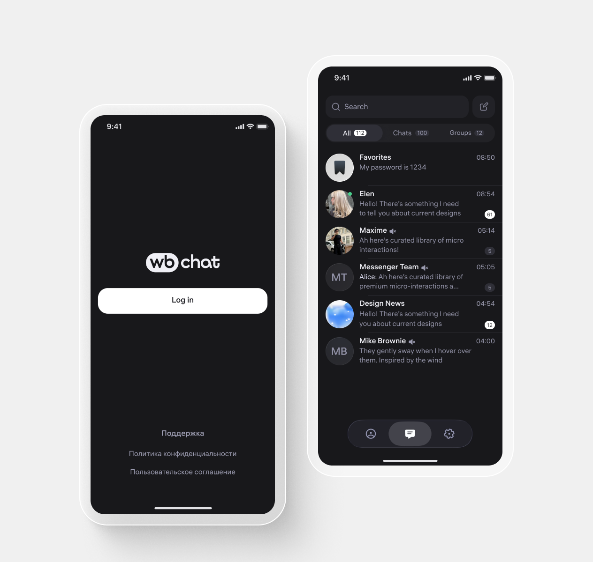
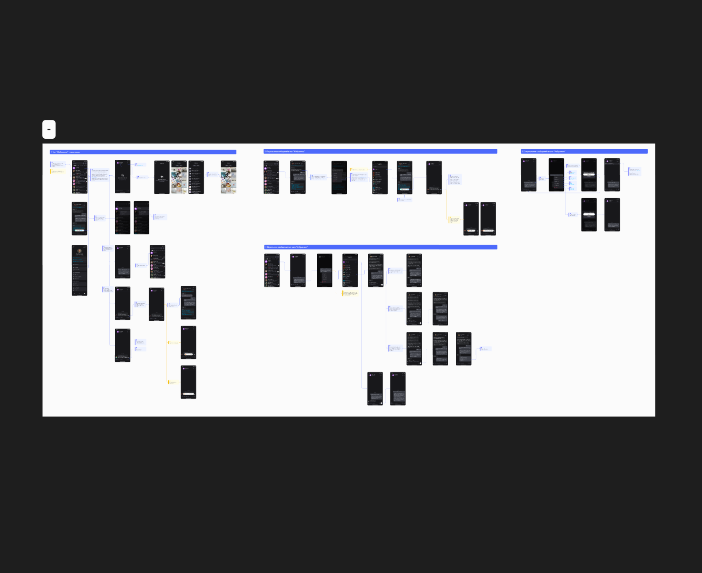
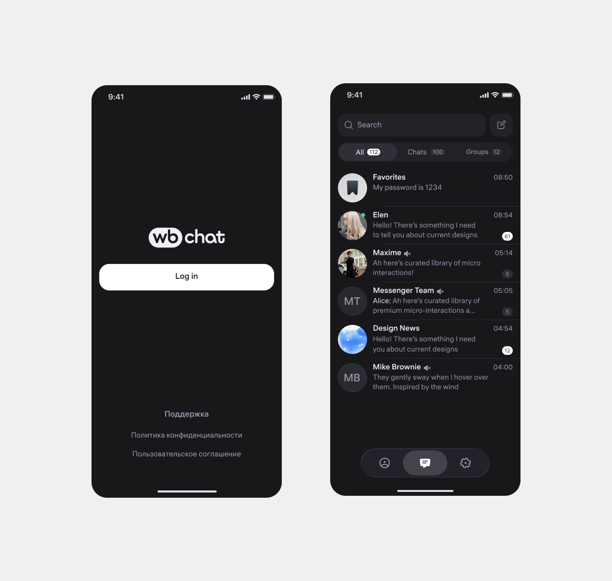
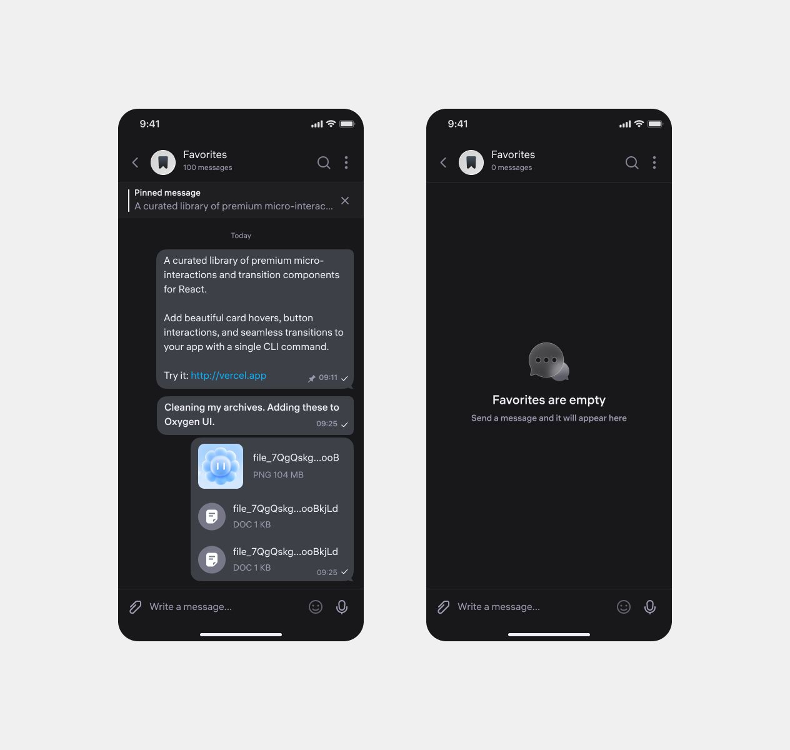

## About the product

WB Chat is a messaging platform for conversations and calls, developed within one of the largest e-commerce holdings. It is currently available as a B2B product for employees, with a broader consumer release planned for the future.

I design experiences across iOS, Android, and Web, leading projects end to end—from early concepts and product definition through implementation and release.

## Context and problem

WB Chat is a messenger for chat and calls.

Important things arrive scattered across every one of those threads. There was no built-in way to set any of it aside for yourself — meaning the absence of a Saved Messages equivalent was a missing table-stakes feature.

Then interviews surfaced a detail: users who *do* have a Favorites equivalent in other messengers call it a junk drawer — a place they can't find anything in. So the baseline feature is already built everywhere, and it already doesn't work.

The core problem: Favorites doesn't have a storage problem, it has a retrieval problem. "Junk drawer" isn't about volume — it's the name for a place things go into and never come out of. Here's one respondent's Favorites thread in Telegram:
<video data-src="/videos/wbchat/Area.mp4" preload="none" muted loop playsinline disableremoteplayback data-lazy-video></video>

## JTBD

Research showed that people treat Favorites less as a place to stash messages and more as a personal space they intend to come back to. The core jobs cluster around three things: saving something important fast, finding it again weeks later, and not drowning in what's accumulated.

The basic save flow is already familiar to users and effectively a standard, so I didn't overthink it.

**The real opportunity** sits at the return step: over time Favorites turns into one long stream that's hard to navigate, especially when you don't remember the exact wording. So the work went into solutions that make search and navigation easier, preserve context, and add structure to what's piled up — without asking users to file anything by hand.

## Framing the problem

The obvious answer: if it's a junk drawer, give it structure — folders, tags. But every one of those solutions moves the work to the moment of saving: pick a folder, apply a tag. And people save precisely so they *don't* have to think right now — they're mid-conversation, they're moving fast.

Which gives us the fork:

**Are we fixing storage — or fixing retrieval itself?**

Bookmarks without good organization turn into a long list fast. But folders don't fully solve it either. So I ran the main line of work on proactive retrieval rather than storage organization.

**Goal.** Give people a place they trust for the things that matter → remove the fear of losing information → increase trust and return frequency.

**Success criteria (how we'll measure):**
- Retrieval rate — the share of saved items a user comes back to at least once. The headline metric: it's what separates a library from a junk drawer.
- Share of users who save at least one message in their first 7/30 days (adoption).
- Return frequency to the section after saving.
- Reduction in "how do I save this / where did my message go" support contacts.
- Qualitative signal: the phrase "junk drawer" disappearing from how users describe their own section in follow-up interviews.

## Discovery & research

Benchmarking: I looked at direct competitors (messengers) and adjacent categories solving the same job on different content.

**Key takeaways:**
- Everyone has the baseline. There's no winning there.
- Manual organization is a solved problem that doesn't work. Everyone shipped it; a minority uses it.
- No major messenger has made retrieval proactive. Saved content sits and waits for users to return to it. That's the open lane.
- None of the comparables manage the lifecycle of saved content — everything is stored forever and stored identically.

I also went through the published research, which fed directly into idea generation.

Before moving to hypotheses, I pinned down the minimum set without which Favorites simply doesn't count as working — you can't ship without it, because this is already considered baseline.

Forwarding messages into Favorites from any chat and back out into a conversation. A flow for writing your own message — a note to self. Pinning messages inside Favorites, jumping to a message in its source chat, deleting saved items, and a separate attachments view. Corner cases and error states were worked through for every flow.

## Hypotheses
Here are some of the ideas I had in mind:

H1 · Conversational search: Favorites answers instead of filtering. The user asks Favorites a question in plain language, right inside the thread, and gets an answer as cards — like a normal message.

H2 · Visibility over organization. Saved content shows up where the person already is: a "3 saved" badge in the chat header, and the most recent save as a card at the top of Favorites itself.

H3 · Reason for saving, instead of category. One tap: *to read* / *to do* / *to reference* / *to keep*. The reasons set a lifecycle: "to read" expires, "to do" nudges you, "to reference" lives forever and gets indexed first, "to keep" flows into a separate feed.

H4 · A cleanup ritual. Once a week — "Favorites review": five cards, swipe keep or drop, 30 seconds.

H5 · The caption becomes the title. A short message sent immediately before or after attachments quietly merges with them into a single card and becomes its title — undoable for a few seconds afterward.

H6 · One action turns a set of saved items into an artifact: a shopping list, a meeting agenda, a link roundup for a colleague.

H7 · A second entry point into Favorites from inside the conversation itself — a DM, group, or channel.

## Solution

In the MVP:

- All baseline flows — one-action save, multi-select, search, jump to source, sync, privacy.
- Contextual resurfacing in the source chat — saved items announce themselves where they're relevant.
- Edge states — first run, empty tabs, single item, very large collections, load failure, offline.
- Empty-state copy as one system — a prompt toward the first action instead of a recital of technical limits.
- Conversational search

The feature is in development. Targets and measurement methods below; this section gets updated at release.

The qualitative bar I hold as equal to the numbers: in follow-up interviews two to three months post-launch, users shouldn't be describing their own section as a junk drawer. The piece of functionality meant to do the heaviest lifting — helping people find what they need faster and with less effort — is conversational search with its own separate search session.
