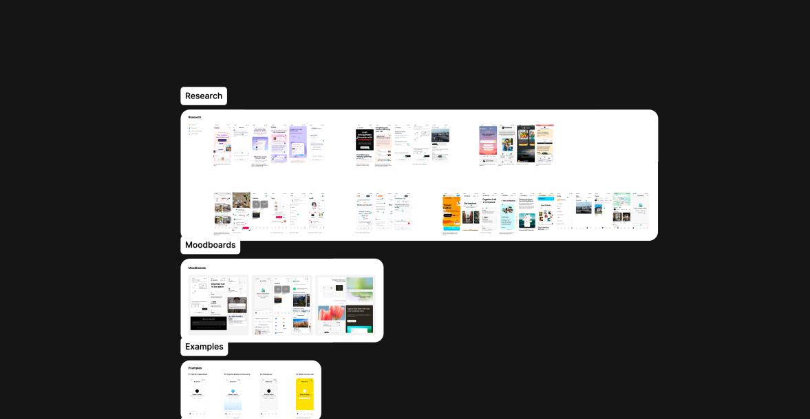
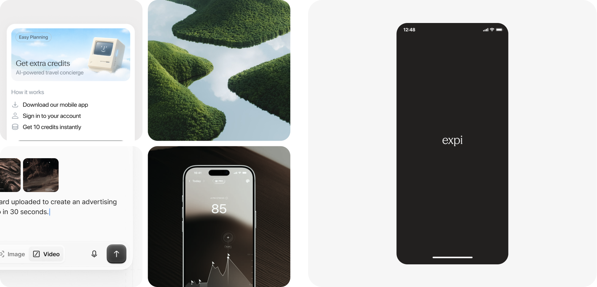
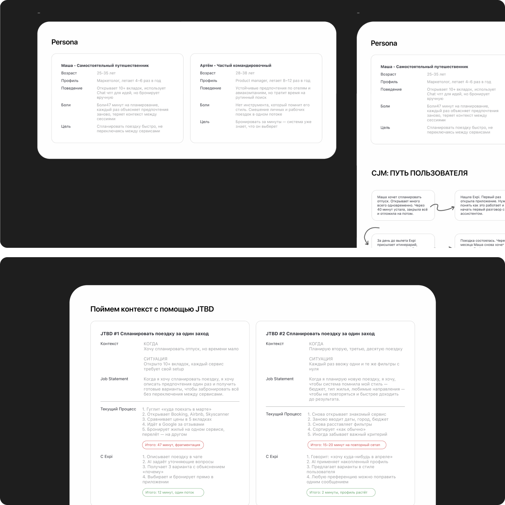
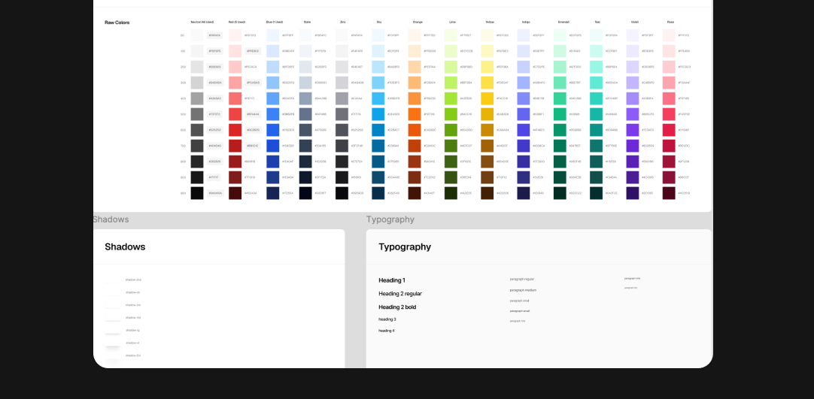
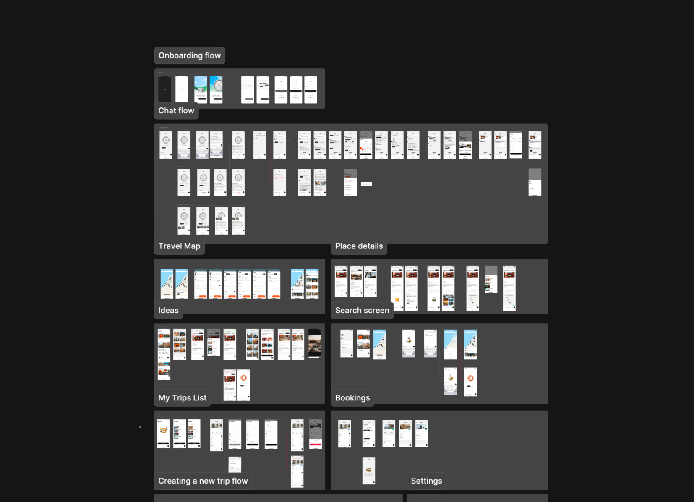
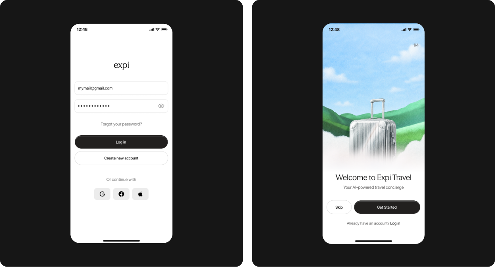
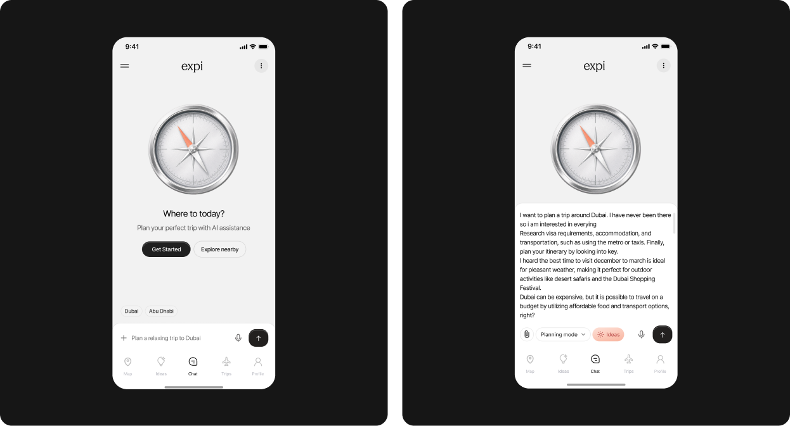
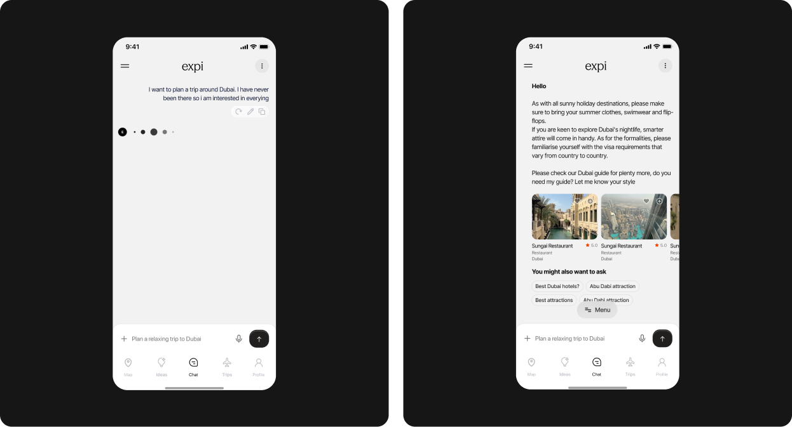
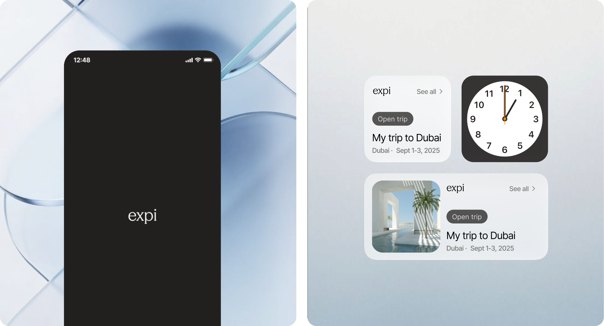

## Контекст и вызов

Мне прислали бриф, пару референсов и дату релиза. Больше ничего — ни исследований, ни продуктовых требований. Стартовая гипотеза: планирование путешествий сломано, и AI может это исправить.

Когда я начала анализировать конкурентов, оказалось, что продукты застряли в одной из двух крайностей: либо умеют искать, но не помнят, кто ты, либо умеют разговаривать, но не дают реального результата — например, завершённого бронирования. Expi мог занять пространство между этими крайностями.

Основная идея, которая держит весь продукт: агент, который помнит тебя и доводит до бронирования. Параллельно я исследовала разные визуальные направления и согласовала с командой финальный подход.

## Исследование

Проект стартовал без пользовательских данных — только с бизнес-гипотезой. Моей первой задачей было выстроить продуктовую основу с нуля: определить цель продукта, бизнес-модель, ценность для пользователя и целевую аудиторию.

Рабочий процесс: определить главную задачу на основе персоны → сформировать два варианта CJM → спроектировать градиент доверия, который вытекает из этих этапов.

Когда я начала изучать основной отчёт, то ожидала увидеть что-то про поиск отелей или сравнение цен. Оказалось, что самая критичная задача возникает ещё до поиска. Пустой экран поискового сервиса парализует. Людям нужен не ещё один инструмент, а тот, кто спросит: «Куда ты хочешь поехать и какой опыт получить?» — возьмёт инициативу на себя и учтёт их предпочтения.
Этот инсайт стал основой всей модели взаимодействия: не поиск по параметрам, а разговор, который ведёт продукт.

**Проектирование доверия и приоритизация MVP.** После того как основные задачи были определены, встал вопрос: что именно делать в первой версии? Я подошла к этому в два шага: сначала ранжировала задачи по критичности — какая из них сильнее всего блокирует пользователя и без решения какой продукт просто не работает. Затем для каждой задачи выделила функции и оценила их по соотношению ценности и сложности реализации.

## Решение и реализация

Когда приоритеты MVP были определены, встал главный вопрос проекта: как вообще должен работать интерфейс?

### Что рассматривали

Первый очевидный вариант — гибрид: чат с элементами поиска внутри. Фильтры, карточки, сортировка — всё привычное. Цель — не пугать пользователя новой моделью и дать ему знакомые паттерны.
Но чем глубже мы смотрели на этот вариант, тем яснее становилось противоречие. Гибрид решает проблему интерфейса, но не решает проблему пользователя.

### Почему выбрали разговорный интерфейс

Во-первых, инсайт из JTBD: основная задача пользователя — не найти отель, а перестать стоять перед пустым экраном, не зная, с чего начать. Разговор снимает этот паралич.
Во-вторых, разрыв на рынке: конкуренты застряли ровно посередине между поиском и разговором, и ни один не закрывал оба сценария. Гибрид поставил бы Expi в тот же ряд.
В-третьих, технические возможности AI: модель умеет запоминать контекст, уточнять предпочтения и применять их к следующим запросам. Классический поиск этот потенциал просто не раскрывает.

Выбор разговорного интерфейса сразу поставил новые дизайн-вопросы: как выглядит ответ ассистента? Как пользователь понимает, что система его запомнила? Эти и другие вопросы стали основой следующего этапа: проектирования флоу и пограничных сценариев.

## Пограничные сценарии

Когда основные флоу были спроектированы, началась самая нетривиальная часть работы. Уязвимое место продукта — моменты неопределённости: когда модель не уверена, когда пользователь и система понимают друг друга по-разному или когда разговор уходит не туда.

**Пограничный сценарий 1 — AI не уверен в ответе.** Самое простое решение — показать результат и промолчать о сомнениях. Но это подрывает доверие: пользователь рано или поздно замечает, что рекомендация неточна.
Я выбрала другой принцип: если модель не уверена, она уточняет. Не показывает индикатор неуверенности и не выдаёт предупреждение, а задаёт конкретный вопрос, который помогает дать лучший ответ.

**Пограничный сценарий 2 — противоречивая выдача.** Когда запрос пользователя содержал противоречия — например, «бюджетно, но с хорошим отелем в центре Дубая», — система не выбирала один параметр, игнорируя другой. Ассистент явно обозначал конфликт и предлагал выбрать, что важнее в этой поездке. Это небольшой момент, но именно он формирует ощущение, что продукт тебя слышит.

Я считаю, что пограничные сценарии в AI-продукте — это ядро UX. Именно в такие моменты пользователь решает, доверять продукту или уйти, а доверие напрямую влияет на лояльность.

## Передача в разработку

Дизайн-систему я начала строить параллельно с проектированием флоу.

Выбор атомарного подхода был неслучайным. Команда разработки небольшая, и времени на долгий онбординг не было. В основе системы — палитра токенов: цвета, типографика и тени. Токены названы по смыслу, а не по буквальному значению цвета — не #1A1A2E, а color/background/primary. Это означает, что при смене темы или ребрендинге не нужно переписывать компоненты.

Из 11 спроектированных флоу три были определены как критические — те, без которых продукт не работает в принципе: разговорный онбординг, планирование поездки и бронирование с оплатой. Для каждого флоу проработаны пустые состояния, загрузка и другие пограничные сценарии.

## Итог

Продукт был спроектирован с нуля и передан в разработку в сжатые сроки, без готовой концепции на старте.

В результате получились полный путь пользователя от онбординга до бронирования, 11 флоу с проработкой всех состояний, масштабируемая дизайн-система и документация.

В следующий раз я бы провела пользовательское тестирование до передачи в разработку. Разговорный интерфейс — новая модель для людей, и некоторые решения могли оказаться неочевидными.
