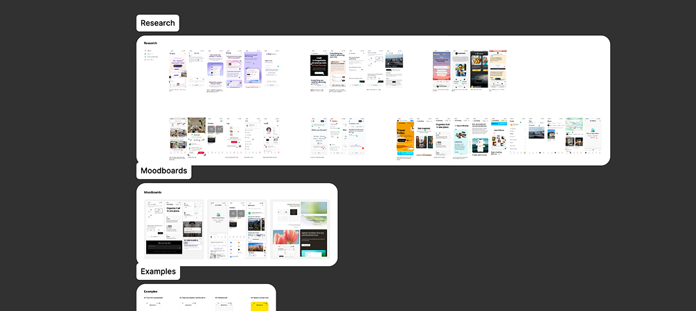

## Контекст и вызов

Мне прислали бриф, пару референсов и дату релиза. Больше ничего - ни исследований, ни продуктовых требований. Стартовая точка: есть идея что планирование путешествий сломано, и AI может это починить.

Когда я начала смотреть на конкурентов, показалось продукты застряли в одной из двух крайностей: либо умеют искать, но не помнят кто ты, либо умеют разговаривать, но не дают реального результата в виде брони. Пространство между ними может выступать expi.

Основная идея, которая держит весь стек: агент, который помнит тебя и доводит до брони.

## Процесс

Временный текст — замените на описание процесса и ключевых решений. Изображение можно добавить так:

## Результат

Временный текст — замените на результаты и эффект от проекта.
