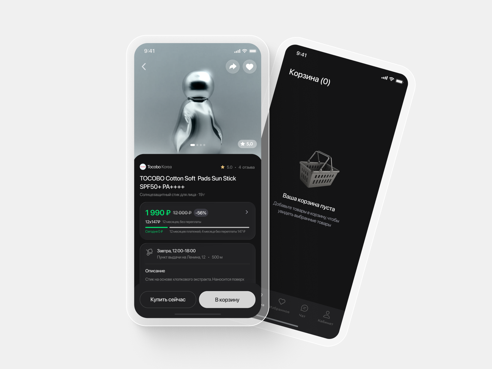
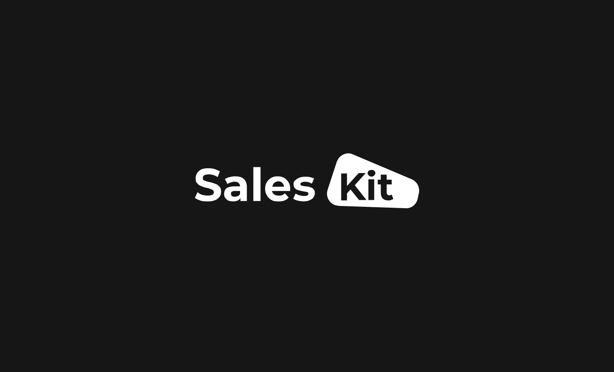
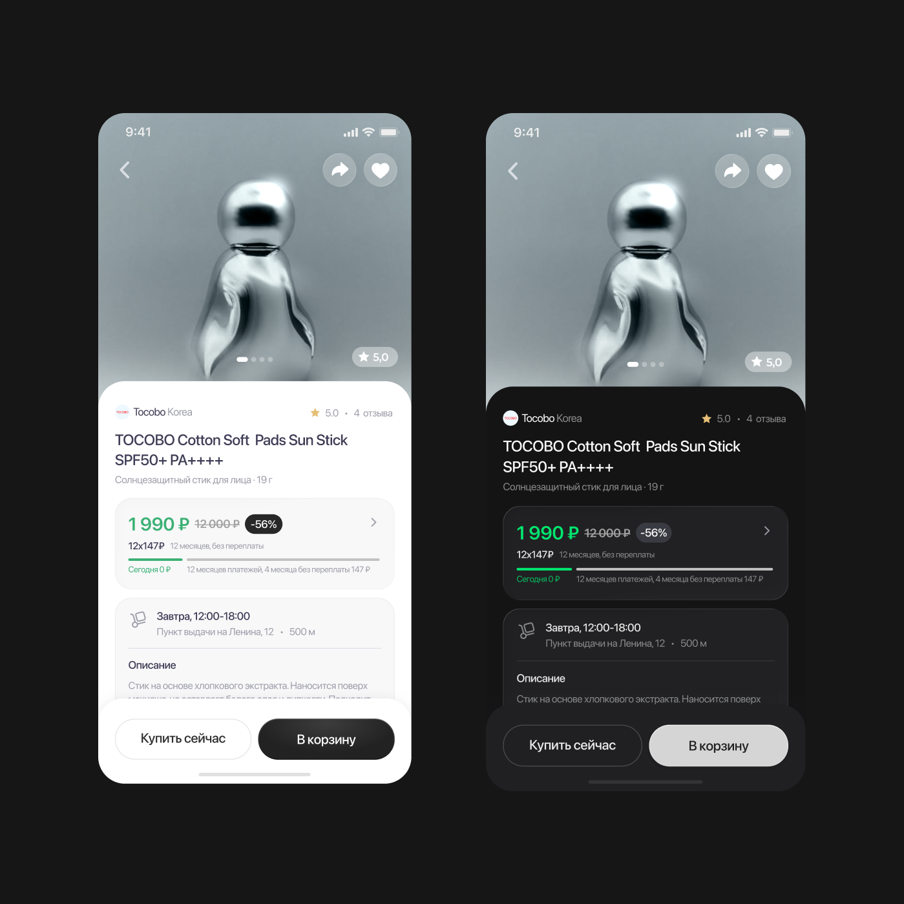
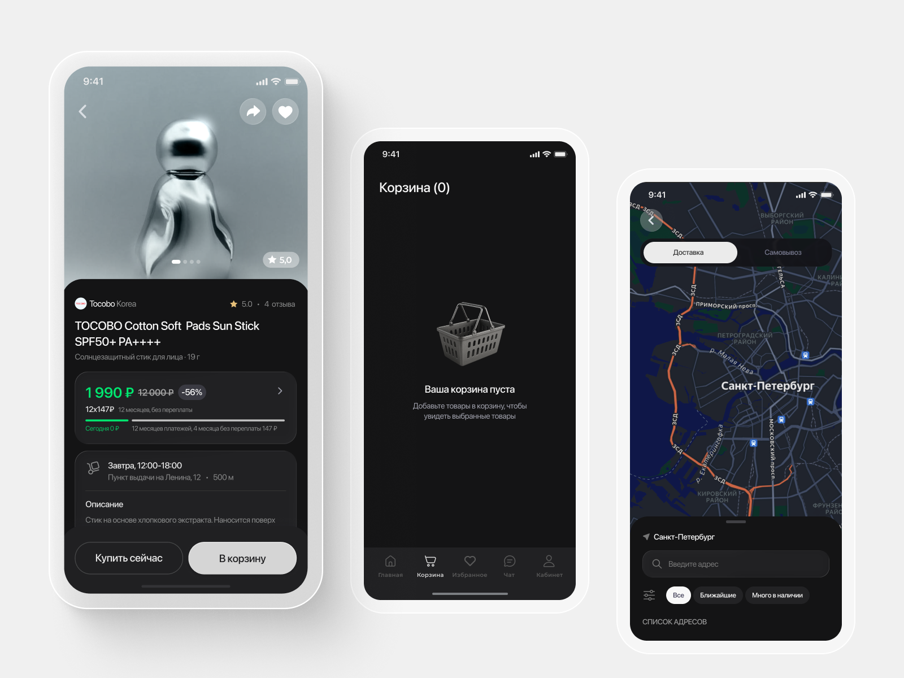
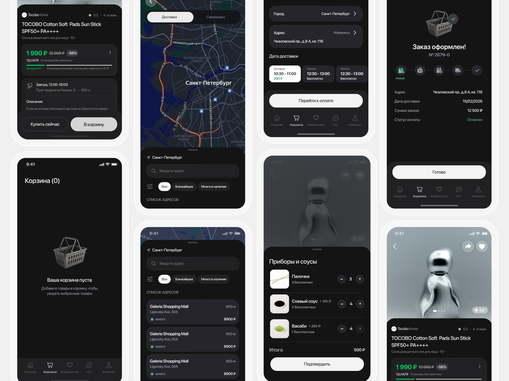

## Обзор

Продукт: SalesKit — платформа-конструктор, на которой бизнес за 1–3 дня запускает мобильное приложение и сайт: интернет-магазин, доставку еды, службу доставки, салон услуг.
Роль: единственный продуктовый дизайнер.
Зона ответственности: мобильное приложение (iOS), сайт, дизайн-система, печатные материалы, графика и коммуникация.

## Что такое SalesKit

Обычно, чтобы у бизнеса появилось своё приложение, нужен подрядчик, полгода разработки и бюджет, который малый бизнес не потянет. SalesKit продаёт другую модель: готовая платформа по подписке, где вместо разработки с нуля — сборка из модулей. Каталог, корзина, оплата, доставка по зонам, бонусная программа, push-уведомления, интеграции с iiko, rKeeper, 1С, СДЭК, СБП. Клиент выбирает нужное, наполняет контентом — и через пару дней принимает первые заказы.

Причём это не один продукт, а целая экосистема, которая должна работать согласованно. Весь визуальный слой этой экосистемы — на мне.

## Главный вызов
В обычном продукте дизайнер знает свою аудиторию. Здесь всё иначе: я проектирую не для конкретного бизнеса, а для любого. Один и тот же экран каталога должен одинаково хорошо работать у пиццерии, цветочного магазина, автозапчастей и падел-клуба.

Отсюда два ограничения, которые определяют почти каждое решение.

### Я не контролирую контент

Клиент сам наполняет приложение. Значит, интерфейс должен выживать в любых условиях: товар без фотографии, фотография в неудачной пропорции, название в три строки, каталог из пяти позиций и каталог из пяти тысяч, категория без вложенных подкатегорий.

Поэтому я проектирую не «красивый экран с идеальным контентом», а **набор состояний**: пустое, минимальное, перегруженное, ошибочное. Дизайн должен держаться сам, без дизайнера рядом.

### Две аудитории вместо одной

У платформы два пользователя, и они не пересекаются:

- покупатель — обычный человек, который хочет заказать пиццу и не готов ни в чём разбираться;
- владелец бизнеса — тот, кто собирает приложение в панели, часто без опыта работы с подобными инструментами.

Второй тип пользователей — самый недооценённый. От того, насколько понятно устроен процесс сборки, напрямую зависит обещание «запуск за 1–3 дня». Если человек застревает на настройке зон доставки, никакой скорости не будет.

## Что я делаю

- **Мобильное приложение (iOS).** Проектирую интерфейсы и собираю готовые модули в цельный пользовательский путь: каталог → карточка → корзина → оформление → оплата → отслеживание заказа → повторный заказ. Отдельно работаю с логикой лояльности: бонусный счёт, кешбэк, промокоды, реферальная программа — всё то, что должно быть заметным, но не мешать основному сценарию покупки.

Адаптирую дизайн под разные бизнес-модели и слежу за тем, чтобы кастомизация под бренд клиента (цвета, логотип, айдентика) не ломала читаемость и доступность интерфейса.

- **Сайт.** Делаю веб-версии с акцентом на понятную структуру и конверсию. Ключевая задача — чтобы сайт и приложение читались как **единая экосистема**, а не как два разных продукта: одинаковые паттерны, одинаковая логика, узнаваемый визуальный язык. При этом веб — это другой контекст: другой размер экрана, другая мотивация, часто первое касание с брендом.

**Дизайн-система.** Это то, что вообще делает модель SalesKit возможной. Формирую и развиваю систему компонентов, токенов и правил, на которой собираются проекты клиентов. Каждый новый компонент проектируется с вопросом: «А как он поведёт себя у бизнеса, который я никогда не увижу?»

**Печатная продукция и графика.** Разрабатываю флаеры, промоматериалы и графику, с помощью которой бизнес общается с клиентами офлайн. Это не побочная задача, а часть воронки: печатный материал с QR-кодом — один из основных способов, которыми кафе или магазин приводит своих постоянных гостей в приложение. Поэтому визуальный язык печати должен продолжать язык интерфейса, а не жить отдельно.

## Результат

Платформа выдаёт то, ради чего создавалась: **от заявки до первого клиента — 1–3 дня**, без разработки с нуля и без бюджета в сотни тысяч рублей. Малый и средний бизнес получает собственный канал продаж по цене подписки.

SalesKit входит в рейтинги «Рейтинга Рунета» как один из ведущих разработчиков мобильных приложений — №1 в Екатеринбурге и в топ-5 в категории «Покупки» по итогам 2024 года.

