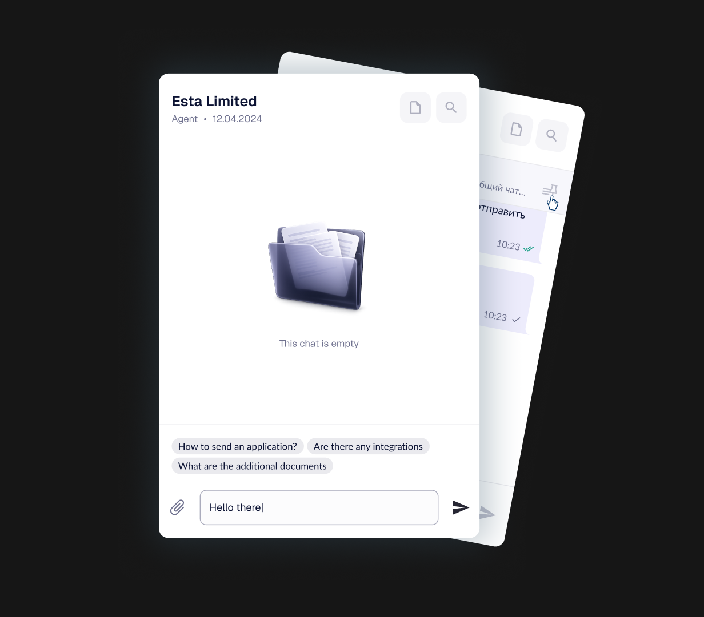
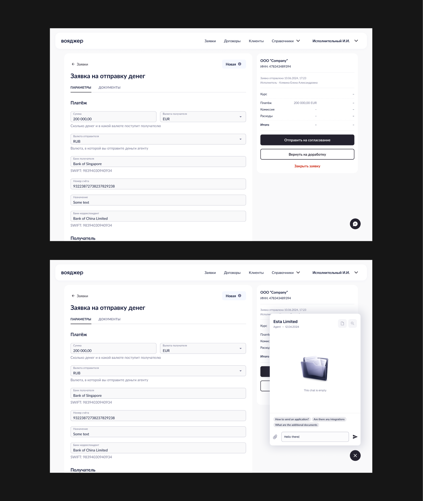
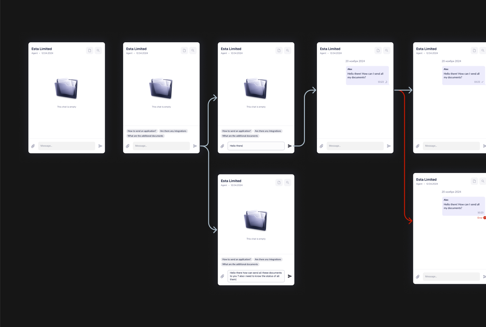
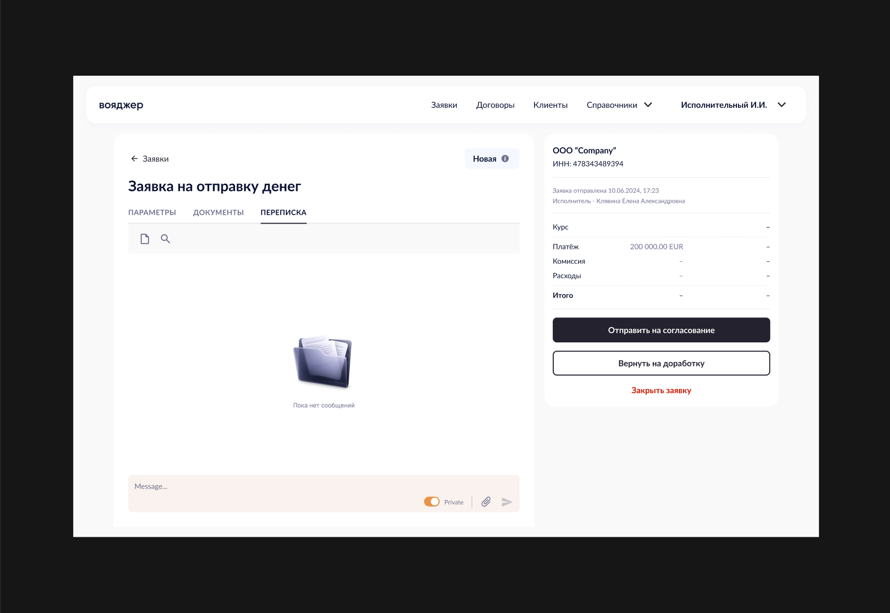
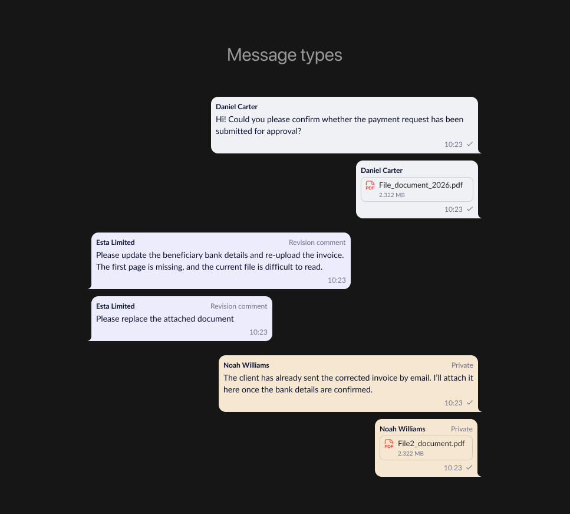
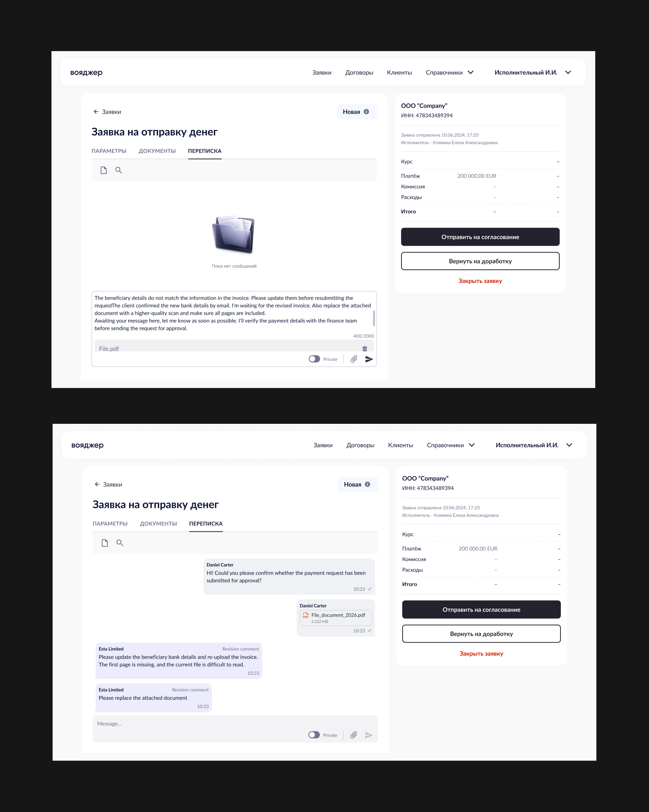

## Обзор
Продукт: Voyager — веб-приложение для валютных и внешнеэкономических операций (Банк «Санкт-Петербург»)

Одна фраза, с которой все началось: «Нам нужен чат в экспортных заявках» - так звучал запрос от бизнеса. Через две недели ресёрча он превратился в другой: «Нам нужна система переписки, которую можно поставить в любой документ за спринт, а не за квартал».
Разница между этими двумя формулировками — и есть содержание кейса.

## Проблема

Я начала с интервью и разбора реальных заявок вместе с валютными контролёрами и клиентскими менеджерами. Картина повторялась от сотрудника к сотруднику.

- Диалог был размазан по четырём каналам. Почта, телефон, мессенджер, иногда — курьер с бумагами. Чтобы понять, на чём остановились по заявке, сотрудник открывал систему, потом почту, потом искал в переписке нужную ветку, потом звонил.

- Контекст терялся при передаче. Уходит сотрудник в отпуск — вместе с ним уходит история. Новый человек открывал заявку и видел статус «на доработке» без единого следа, *почему* она на доработке и что уже обсуждалось.

- Клиент не понимал, что происходит. Заявка висит, причина неизвестна, ответ — только через звонок в колл-центр. Значительная часть обращений в поддержку была не проблемой, а просто вопросом «а что с моей заявкой?».

Каждая из этих болей по отдельности выглядела как мелкое неудобство. Вместе они складывались в дни задержек по сделкам, где задержка стоит денег.

## Решение: не чат, а модуль

Самое важное решение в проекте я приняла не в Figma, а на встрече с продуктом и разработкой. Я задала один вопрос: где ещё, кроме экспортных заявок, людям нужно будет переписываться? Ответ был очевиден всем в комнате — в импортных заявках, в договорах, в паспортах сделок, в валютном контроле. То есть практически везде.

Это меняло постановку задачи. Мы проектировали не экран, а компонент, который будет жить в десятке разных контекстов. И это дало:

- Новый документ — не новый проект. Подключить переписку к следующему типу документа стало задачей на настройку, а не на полный цикл «дизайн → разработка → тестирование». Аргумент, который убедил стейкхолдеров быстрее любого другого: время вывода фичи в соседнем разделе сокращается в разы.

- Одинаковый опыт на всём продукте. Валютный контролёр работает и с заявками, и с договорами. Если переписка в них устроена по-разному, он учится дважды и ошибается вдвое чаще. Единый модуль снимает этот налог.

- Предсказуемость для разработки. Одна кодовая база вместо пяти похожих реализаций — это меньше багов и заметно дешевле поддержка. Для банка, где любая ошибка в финансовом документе стоит дорого, это был не эстетический, а риск-аргумент.

Формулировка «модульная система» звучит как инженерное решение. По сути это было продуктовое: мы вложились один раз, чтобы не вкладываться пять.

## Проектирование: три роли

Главная сложность модуля оказалась не в технике, а в том, что вокруг одной заявки встречаются люди с очень разными правами и целями.

Отсюда выросло решение, которое стало центральным для интерфейса: **приватные сообщения**. Сотрудник может переключить режим ввода — и сообщение уходит не клиенту, а во внутреннюю ветку.

Здесь дизайн решал вопрос цены ошибки. Одно приватное сообщение, случайно отправленное клиенту, — это репутационный, а иногда и регуляторный инцидент. Поэтому режим приватности сделан не галочкой в углу, а сменой состояния всего поля ввода: меняется фон, подпись и цвет отправляемого сообщения. Промахнуться, не заметив, практически невозможно.

Дальше набор действий диктовался тем, как люди реально работают с документами:

- Ответ на сообщение — в длинной ветке по заявке без цитирования теряется нить.
- Перенос сообщения в другую заявку — самая «банковская» функция. Клиенты регулярно пишут не туда, и раньше это означало пересказ вручную.
- Закрепление — реквизиты и договорённости не должны утонуть под сотней сообщений.
- Теги и пометка «важное» — быстрая навигация по длинным веткам.
- Поиск — по тексту, по имени файла, по тегам. Отдельно проработан сценарий с навигацией по найденным совпадениям и счётчиком результатов.
- Вложения — с превью, потому что 90% переписки здесь крутится вокруг документов.

Каждый сценарий я разбирала до состояний: пустой чат, отправка, ошибка отправки, повтор, длинное сообщение, сообщение с вложением, состояние поиска без результатов.

## Процесс

**Ресёрч.** Разобрала, как переписка встроена в интерфейсы Тинькофф, Сбера и Альфа-банка — и, что важнее, как она встроена в рабочие инструменты, где диалог привязан к объекту, а не к человеку.

**Концепции.** Собрала 5 вариантов интеграции: от полноэкранной вкладки до плавающего виджета. Довела до тестирования два основных подхода — вкладку внутри заявки и виджет-оверлей.

**Валидация.** Интерактивный прототип в Figma, тесты с реальными сотрудниками банка. Победил гибрид: полноценная вкладка «Переписка» внутри документа плюс компактный виджет для быстрого доступа из других разделов.

**Дизайн-система.** Итого 12 новых компонентов с документацией и гайдом по интеграции в новые разделы — чтобы следующая команда подключала переписку без меня.

## Результаты

Основные результаты были такие:

- −40% времени на решение вопроса по заявке. Диалог, который раньше шёл через почту и звонки, теперь происходит там же, где документ.

- −35% обращений в колл-центр по статусам. Клиенты перестали звонить, чтобы узнать, что происходит.

- 78% пользователей воспользовались чатом в первый месяц. Для B2B-инструмента с консервативной аудиторией это высокая цифра — функцию не пришлось продавать внутри.

- CSAT процесса обработки заявок: 6.2 → 8.7.

Дополнительно: конверсия завершённых заявок +15%, скорость обработки заявок сотрудниками +20%, доля незавершённых заявок −18%.

И то, ради чего строилась модульность: разработка последующих чат-сценариев в других разделах ускорилась примерно на 60%, количество багов в них снизилось за счёт переиспользования готовых компонентов.

