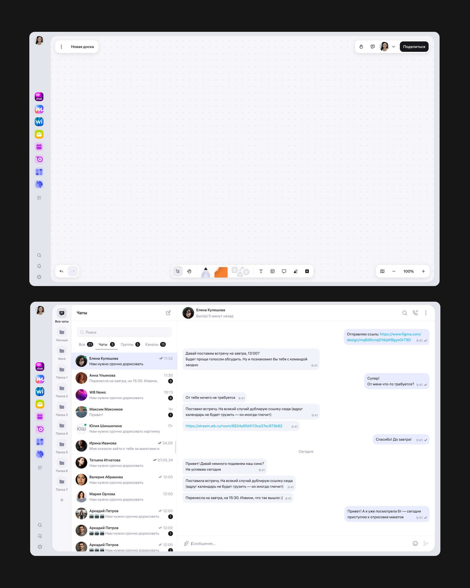
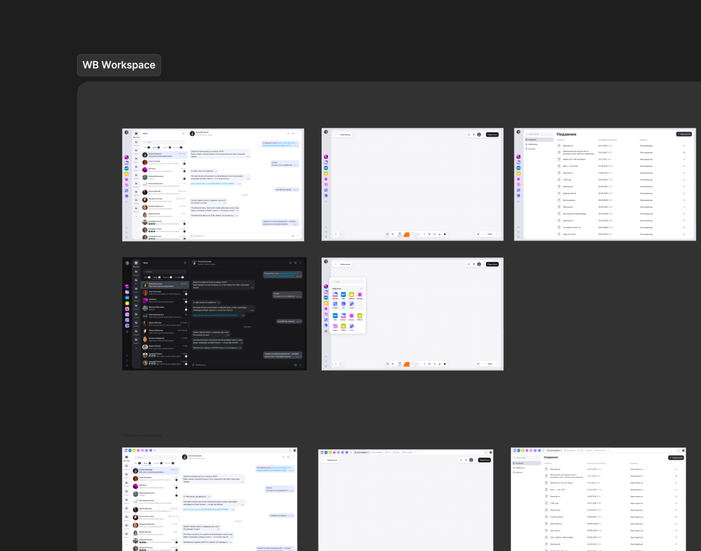

## О проекте

Единая рабочая среда для сотрудников компании — аналог корпоративных workspace-решений, собранный внутри и под свои процессы. Под одной оболочкой живут несколько самостоятельных продуктов: вики, доски, календарь, мессенджер, почта, трекер задач, формы и другие. Я отвечаю за слой, который связывает их в одну среду: оболочку, навигацию, кросс-продуктовые паттерны и правила, по которым команды собирают свои интерфейсы.

**Статус проекта.** Продукт находится в активной разработке, публичного релиза на момент публикации не было. Результаты оцениваю по данным юзабилити-тестирования прототипов и по внутреннему принятию дизайн-системы продуктовыми командами. Финальные продуктовые метрики появятся после выката на сотрудников.

**О формате кейса.** Проект под NDA. Здесь описан процесс и логика решений; интерфейсы показаны схематично, без реального визуального языка, названий и данных. Детали могу разобрать на созвоне.

## Моя роль

Я отвечаю за платформу как продукт, у которого есть свои пользователи — и сотрудники компании, и продуктовые команды внутри.

Зона ответственности:

- оболочка платформы и глобальная навигация;
- кросс-продуктовые паттерны: переключение между продуктами, поиск, уведомления, профиль, настройки, доступы;
- платформенная часть дизайн-системы и правила её применения;
- процесс синхронизации с продуктовыми командами — ревью, критерии, регулярные синки.

## Контекст и проблема

Продукты платформы разрабатывались параллельно и независимо. К моменту, когда их начали собирать в одну среду, у каждого сложилась собственная логика интерфейса.

Что было не так:

1. Разная навигация. Переключение между продуктами, точки входа в поиск и уведомления, состав и поведение верхней панели — везде своё. Сотрудник за день переходит между почтой, вики, календарём и досками десятки раз и каждый раз переучивается.
2. Дублирование разработки. Каждая команда проектировала и писала свою версию одних и тех же элементов оболочки. Один и тот же функционал оплачивался несколько раз.
3. Отсутствие правил. Не было ответа на вопрос, что в интерфейсе принадлежит платформе, а что продукту. Споры решались авторитетом, а не критерием.

## Решение 1. Единая навигация

Начала с аудита, а не с макетов. Разобрала навигацию всех продуктов платформы и собрала сравнительную карту:

- где находится вход в другие продукты;
- как устроены поиск, уведомления, профиль и настройки;
- какие элементы живут в верхней панели, какие в боковой;
- какая терминология используется для одинаковых по смыслу сущностей.

Каждое расхождение разметила по одному признаку: **это осмысленная специфика продукта или историческая случайность?** Оказалось, что большинство различий — второе: они возникли не из задач пользователя, а из того, что команды не сверялись между собой.

Спроектировали единую оболочку, внутри которой продукт отвечает только за свою рабочую область:

- **постоянный рельс приложений** — сквозной для всех продуктов, положение не меняется при переходе;
- **переключатель продуктов** с поиском по приложениям и настраиваемым блоком «Избранное» — сотрудник выносит наверх те 3–4 продукта, в которых работает ежедневно;
- **сквозные элементы** — глобальный поиск, уведомления, профиль и настройки в фиксированных местах;
- **чёткая граница** между зоной платформы и зоной продукта.

## Решение 2. Правила

Договорённость о единой навигации без механизма поддержки разъезжается за несколько спринтов: команды работают параллельно, у каждой свои дедлайны, отступления копятся незаметно и по отдельности выглядят безобидно.

- Ввела регулярное ревью макетов продуктовых команд на соответствие платформенным паттернам. Ревью встроено в цикл команды до передачи в разработку — так правки стоят дёшево.

- Самая ценная часть — я описала, **когда команда может отойти от паттерна, а когда нет**. Без этого ревью превращается в вкусовщину и конфликт, а с ним — в проверяемое правило. Отдельно описала процедуру: если команде нужен паттерн, которого в системе нет, она не изобретает его локально, а приносит кейс — и он либо покрывается существующим решением, либо становится новым платформенным паттерном для всех.

- Синк по платформенным паттернам. Запустила регулярную встречу продуктовых дизайнеров, на которой команды: сверяются по изменениям в платформенном слое; приносят сценарии, которые система пока не покрывает; обсуждают спорные случаи из ревью.

## Результаты

Продукт ещё не выкачен, поэтому оцениваю результат по принятию внутри и по тестам прототипов:

- единая навигационная модель согласована со всеми продуктовыми командами и вошла в разработку;
- оболочка реализуется как переиспользуемый слой — новые продукты платформы подключаются к готовой навигации вместо того, чтобы проектировать свою;
- дизайн-ревью и синк по паттернам регулярно проходят с участием продуктовых команд;
- юзабилити-тестирование прототипов подтвердило работоспособность навигационной модели: участники справлялись с переключением между продуктами и поиском нужного приложения;
- спорные случаи по системе решаются критериями, а не эскалацией.
